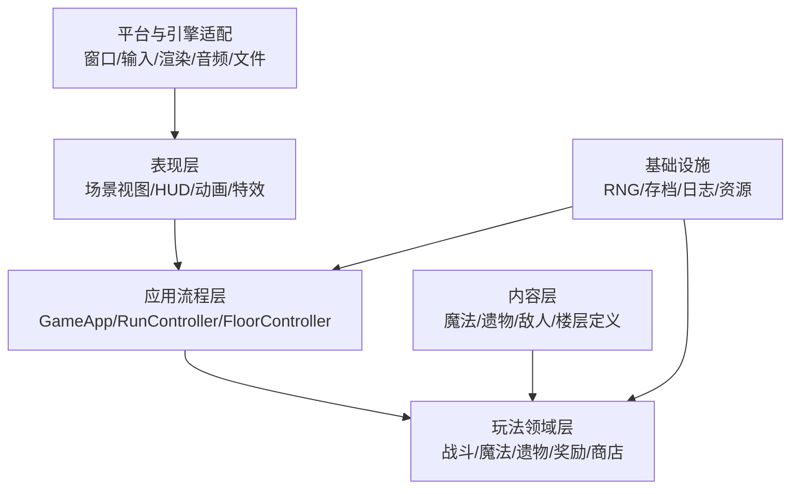
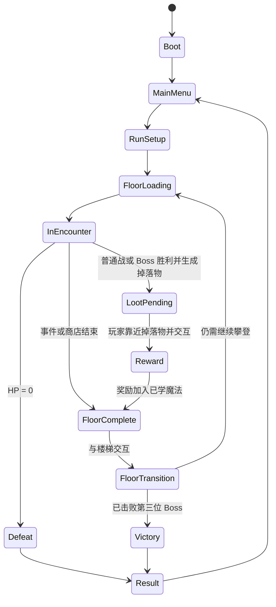

# 《秘法高塔》（暂名）系统架构

## 1. 文档目的

本文定义玩法逻辑架构与 SFML 平台边界，用于指导后续 C++20 实现。项目已选择 SFML 3.1.0 与 CMake，当前已经存在窗口/输入适配、纯 C++ 玩家控制器、最小战斗会话和 CTest 测试目标；音频、内容数据格式和完整测试框架仍需后续决定。文中的未创建目录仍属于计划边界。

## 2. 架构目标

- 支持一层一层加载和卸载，不常驻全部塔层。
- 用确定性种子重现楼层、遭遇、奖励和商店结果。
- 将玩法规则与渲染、输入、音频、文件系统解耦。
- 支持魔法、遗物、敌人和事件的数据驱动扩展。
- 让伤害、回血、冷却、奖励和进度等纯规则可单元测试。
- 先完成单线程垂直切片；只有性能测量证明需要时才增加并行复杂度。

## 3. 分层结构



依赖方向应朝向稳定的玩法规则。领域层不直接调用具体渲染、音频或键盘 API；表现层读取领域状态并发送玩家意图。

## 4. 核心系统与职责

| 系统 | 责任 | 不负责 |
|---|---|---|
| `GameApp` | 启动、主循环、顶层状态切换 | 具体战斗规则 |
| `TowerSession` | 把战斗结果、奖励、装备、楼梯和下一层串成可执行流程 | 绘制 SFML 图形 |
| `RunController` | 创建/结束本局，持有本局种子、玩家构筑与 Boss 进度 | 绘制 HUD |
| `FloorController` | 生成、加载、激活、结算和卸载一层 | 直接决定魔法伤害 |
| `EncounterDirector` | 按楼层类型启动普通战、事件、商店或 Boss | 保存渲染对象 |
| `CombatWorld` | 战斗实体、命中、伤害、死亡和战斗结束条件 | 奖励界面 |
| `EnemyController` | 敌人追击、前摇、攻击有效帧、后摇和攻击序列 | 直接修改玩家 HP |
| `PlayerState` | HP、金币、普通/Boss 已学魔法、三槽普通装备、终极槽、遗物集合 | 输入设备读取 |
| `SpellSystem` | 施法条件、效果触发、槽位与冷却状态 | UI 图标布局 |
| `RelicSystem` | 注册修正与触发器，处理叠加和防重入 | 直接修改表现动画 |
| `RewardSystem` | 从对应池生成不重复候选并应用选择 | 商店交易 |
| `MerchantSystem` | 商品生成、价格校验、购买事务 | 普通战奖励 |
| `FloorGenerator` | 从种子和楼层上下文生成可验证楼层描述 | 直接创建引擎节点 |
| `ContentRegistry` | 加载和查询内容定义，校验 ID 与引用 | 持有本局进度 |
| `SaveService` | 设置、解锁和可选本局快照的序列化 | 决定游戏规则 |
| `AssetService` | 资源定位、加载、缓存和卸载策略 | 内容平衡 |

当前垂直切片由纯 C++ `TowerSession` 持有 `RunController` 和至多一个 `CombatSession`。SFML `main.cpp` 只提交 `PlayerIntent` 并读取状态快照；奖励按键、独立装备覆盖层、楼梯解锁及玩家与楼梯交互区域的相交校验由 `TowerSession` 与 `RunController` 决定。

## 5. 状态所有权

```text
GameApp
└── RunController (仅在本局期间存在)
    ├── RunState
    │   ├── PlayerState
    │   │   ├── LearnedSpells
    │   │   ├── EquippedSlots[3]
    │   │   └── RelicInventory
    │   ├── floorIndex
    │   ├── bossesDefeated
    │   └── runSeed
    └── FloorController (同一时间只有一个活动实例)
        ├── FloorState
        ├── Encounter
        └── CombatWorld（仅战斗层存在）
```

- `RunController` 是本局状态的唯一所有者。
- `FloorController` 的生命周期不得超过当前楼层。
- UI 和表现对象只能观察或提交命令，不能成为 HP、金币、冷却或奖励的权威来源。
- 不使用可变全局变量或隐藏单例保存玩法状态。

## 6. 顶层状态机

`AppFlowController` 持有可选的 `TowerSession` 并管理 `Start/Playing/Pause/Result` 页面。暂停页由 `PauseMenuItem::ReplayCurrentFloor/SaveAndExit` 保存当前高亮项；上下输入只修改菜单选择，确认后才重开本层或暂退。暂退到 Start 时保留同一个 `TowerSession` 供 Continue 使用，但当前没有磁盘序列化，进程关闭后不会保留。结果页确认则创建新实例。`TowerSession` 在每层调度前保存 `RunController` 与 `FloorScheduler` 快照，本层重开时恢复快照后重新生成同一种子楼层，不保存或复用旧层实体。

事件/商店验收入口使用 `TowerSessionConfig::firstFloorTypeOverride` 显式覆盖首层类型；正式新局不设置该字段，仍由 `FloorScheduler` 的确定性随机流和保底规则决定楼层。商店预览使用配置副本提供测试金币，不修改正式配置。预览入口只改变测试会话，不在调度器中加入环境相关的随机分支。



`LootPending` 将战斗输入与奖励选择输入隔离：战斗结束后保留当前地图和玩家位置，掉落物位于最后敌人的死亡位置，只有空间相交并提交交互才进入 `Reward`。奖励和楼梯交互是独立状态，防止重复发放奖励或重复过层。`LoadoutOverlay` 不是顶层流程状态，而是可从 `InEncounter`、`LootPending`、`Reward` 或 `FloorComplete` 打开的暂停覆盖层；关闭后恢复原状态。覆盖层内部由 `LoadoutPage::Spells/Relics` 区分两页：魔法页可分别提交三槽普通装备命令和终极槽装备命令，并依据内容类别拒绝跨槽装备；遗物页只读取本局遗物集合和内容定义并显示效果，不复制或修改遗物权威状态。

## 7. 战斗与时间

### 7.1 更新模型

- 输入层把设备状态转换为 `PlayerIntent`，例如移动轴、跳跃、基础攻击、固有冲刺、固有防御、施放普通槽位 0–2、施放终极槽、交互。
- 玩法层以统一的时间步更新移动、冷却、命中与状态机。
- 当前课程原型直接使用像素空间，权威基线为 `1280×720` 窗口、`42×64 px` 主角碰撞体和身体前缘外 `58×36 px` 普通攻击判定。所有距离仍须集中定义，不能在 UI 和玩法系统分别写死；若未来改为分辨率无关单位，必须通过单独架构决策整体迁移。
- 如果使用可变帧率，所有连续时间逻辑必须使用 delta time；如果物理库要求固定步长，则渲染与模拟分离。
- 暂停状态停止玩法时钟，但 UI 时钟可继续。

### 7.2 伤害与修正

已使用集中式 `DamageResolver`：输入伤害来源、攻击序列、基础伤害、来源/目标倍率、固定减伤与阻挡状态，输出一次不可变的 `DamageResult`。结果包含解析伤害、实际 HP 损失、前后 HP、致死、阻挡和重复序列状态。表现层根据结果播放数字、音效和硬直，不自行重新计算。

基础攻击、三个普通魔法槽、终极槽、敌人技能、敌人碰撞与主动生命消耗均通过该入口。Resolver 按伤害来源分别记录最后结算序列，相同来源和序列不会重复扣血，不同魔法槽之间保持隔离。`RelicRuntime` 在战斗开始时从本局遗物快照建立限时状态和开场触发，并只在明确的来源或目标倍率阶段修正伤害；UI 不重新计算这些效果。

当前原型由 `EnemyController` 产出带递增序列号的攻击有效帧。技能冷却是与 `Chase` 并行推进的独立计时器，开场初始化为定义 CD 的一半；进入 `Windup` 时锁定朝向，只有回到 `Chase` 后才能重新面向玩家；`Windup/Active` 结束后立即回到追击并启动完整 CD。追击停止点按双方 AABB 水平边缘间距计算，有碰撞伤害者为 20 px，无碰撞伤害者为 42 px；技能触发距离另按“玩家宽度至少一半进入技能区域”计算，二者不得共用一个中心距离。`CombatSession` 负责多敌人序列隔离、扣除 HP 并调用玩家受击反应。非位移技能可通过 `EnemyStateView::skillEffectBounds` 向表现层提供只读矩形区域，表现层不自行推导射程；支配是明确不公开范围框的例外。

阿乌拉的“不死大军”是 `CombatSession` 拥有的 Boss 召唤计时器，而不是表现层生成对象：开场和每次 12 秒触发均创建两个拥有独立 AI、HP、伤害序列与血条的无头骑士 `EnemyRuntime`。支配继续通过敌人攻击序列结算，但基础伤害为 0，命中后提交 1.5 秒控制；闪避、防御和负面状态免疫在应用控制前统一判断。

红镜龙的爪击由 `EnemyController` 的普通技能状态机负责；吐焰使用 `EnemyRuntime` 中独立的冷却、1 秒前摇、1.5 秒持续时间和伤害跳数状态。两种技能只有在另一技能不处于执行阶段时才能开始。吐焰每满 0.5 秒生成一个唯一伤害序列并调用 `DamageResolver`，UI 只读取当前 `160×64 px` 火焰 AABB。Boss UI 根据 `EnemyArchetype` 判断主 Boss，不能仅凭楼层类型把召唤物也画成固定 Boss 血条。

建议把遗物修正分为明确阶段：

1. 施法/攻击前置条件。
2. 来源数值修正。
3. 目标数值修正。
4. 最终伤害与 HP 变化。
5. 命中后、受击后、击杀后事件。

事件分发必须防止无限递归；同一效果链应携带事件 ID、深度或已触发标记。

### 7.3 冷却

- 冷却状态属于已装备槽位或魔法实例，二者必须在技术决策中明确。
- 基础数据包含持续时间、是否受遗物缩减、开始时机与切槽行为。
- UI 从权威冷却状态读取 `remaining / duration`。
- 暂停、楼层过渡与奖励界面是否推进冷却必须全局一致；建议仅在可战斗状态推进。
- 三个普通槽保持独立冷却；终极槽另持有一条基础 `18 秒` 的公共冷却，Boss 魔法定义不得各自保存可被换装刷新的运行时冷却。
- 冲刺冷却归 `PlayerController` 所有；防御窗口与冷却归 `CombatSession` 所有。二者不是 `SpellSystem` 内容，UI 只能读取其只读运行时状态。
- 终极公共冷却在战斗实例开始时归零，成功施放后启动；战斗中更换 Boss 魔法只替换内容 ID，不替换该冷却实例。

### 7.4 当前 M1 战斗契约

`CombatSession` 是 `CombatWorld` 的最小垂直切片，不是最终敌人或伤害框架。它只依赖纯 C++ 类型，SFML 主循环负责把键盘映射为意图并绘制只读状态。

- `CombatRequest` 输入遭遇 ID、种子、玩家出生点、敌人实例列表、场地边界、玩家初始 HP 和金币基础奖励。敌人列表为空时仍支持旧单敌人字段，供小型领域测试使用；正式普通楼层传入三个敌人实例，Boss 楼层传入一个。
- `CombatResult` 只报告胜负、原遭遇 ID、击杀数、应发金币和战斗结束后的玩家 HP；它不直接修改 B 拥有的本局资源或楼层进度。
- `PlayerStateView` 和 `EnemyStateView` 是表现/UI 可读取的快照。`CombatSession::enemyStates()` 返回每个敌人的类型、位置、碰撞尺寸、HP 和技能阶段，UI 据此在普通敌人头顶绘制独立血条；Boss 继续使用右上角血条。
- 每次基础攻击都有递增序列号，命中目标后记录序列号，保证活动帧跨越多个更新时不会重复结算。
- `Health`、攻击计时和 AABB 相交判断位于领域层；窗口、键盘和 SFML 图形类型不得进入这些接口。

B 可在流程测试中直接构造 `CombatResult`，但不得另建同名假契约。`RunController` 当前会校验阶段、楼层类型、遭遇 ID、金币与剩余 HP，再原子地推进奖励状态；过期或重复结果不生效。事件和商人层通过 `completeNonCombatFloor()` 完成，不生成普通战斗奖励。A 后续扩展字段时须保留已有语义，或按团队接口变更规则先同步。

## 8. 魔法与遗物数据模型

内容数据格式尚未选择，但逻辑字段应稳定。

```text
SpellDefinition
- id
- displayNameKey
- category/tags
- cooldownSeconds
- castPolicy
- targetingPolicy
- orderedEffects[]
- presentationId
- rewardTier

RelicDefinition
- id
- displayNameKey
- tags
- stackingPolicy
- modifiers[]
- triggers[]
- presentationId
```

- 内容定义只保存配置，不保存每局变化的冷却或计数。
- 本局实例状态通过稳定 ID 引用定义。
- `SpellSystem` 从三个普通装备 ID 和一个可空的 Boss 装备 ID 建立每场战斗运行状态；普通槽实例分别保存剩余冷却，终极运行时独立保存共享剩余冷却。定义保存名称、类别、说明、效果类型、伤害与范围。`CombatSession` 组合直接伤害、持续区域、限时祝福和主动生命消耗效果，并向表现层暴露只读持续时间与冷却状态。
- 配置加载时验证重复 ID、缺失引用、非法数值和无法识别的效果类型。
- 新效果应优先组合已有原子效果；只有无法表达时才增加新的行为类型。

## 9. 确定性随机系统

### 9.1 种子层级

```text
runSeed
├── floorSeed(runSeed, floorIndex)
│   ├── layout stream
│   ├── encounter stream
│   ├── reward stream
│   └── merchant stream
└── event stream
```

不同内容使用独立随机流，避免“新增一个装饰物随机数”改变整层奖励结果。日志和失败报告应记录 `runSeed`、`floorIndex`、楼层类型和内容版本。

当前纯 C++ 实现使用固定的 64 位 SplitMix 派生函数生成楼层种子与各内容通道种子；该算法属于可重现契约，调整时必须同步更新固定种子测试。

正式可执行程序在进程启动时组合系统随机源与高精度时钟生成一个 64 位本局种子，并在游戏窗口标题中显示。该种子在本局内保持不变，楼层、一级 Boss、事件、商店和奖励仍由确定性子流派生；自动化测试继续显式传入固定种子。

### 9.2 楼层生成流程

1. 根据进度计划确定 Boss/普通/事件/商店类型，并应用保底规则。
2. 从楼层模板池选择主题与布局参数。
3. 生成出生点、主要空间、遭遇区域和出口。
4. 验证入口到出口可达，关键平台满足玩家当前移动能力。
5. 填充敌人、交互物和奖励上下文。
6. 验证失败时使用受控重试或回退模板，并记录原因。
7. 将纯数据 `FloorDescriptor` 交给引擎适配层实例化。

当前 `FloorScheduler` 的正式默认节奏为每五层一个 Boss，Boss 固定出现在第 5、10、15 层，完整流程共 15 层；Boss 层优先且不消耗普通候选层的保底计数。`floorsPerBoss` 仍可在测试和快速预览配置中显式缩短。其他楼层由 `encounter` 随机流确定，并通过可配置间隔保证商店和事件出现。商店库存使用独立 `merchant` 随机流，新增楼层布局随机数不会改变商品。

商店/事件层由 `TowerSession` 持有独立的探索玩家和 NPC 交互覆盖层。商店库存按魔法与遗物分行生成，`TowerSession` 保存当前选中商品 ID/索引并消费菜单方向与确认意图；表现层只负责按类别分行、显示价格和选中状态。成功交易后从活动库存移除商品。事件使用 `Untriggered → Choosing → Result` 状态机，`Result` 保存选择 ID 到本层卸载为止，以便重复查看相同效果。覆盖层关闭不完成楼层，只有玩家到达后方楼梯才提交非战斗楼层完成与过层事务。

## 10. 楼梯过层事务

楼梯交互必须是一次不可重复提交的事务：

1. 校验本层已完成、楼梯已解锁，并且玩家碰撞体处于楼梯交互区域内。
2. 锁定重复输入并进入 `FloorTransition`。
3. 结算未应用的奖励或拒绝过层。
4. 计算并应用 `50% × 已损失 HP` 的恢复。
5. 更新楼层/Boss 进度并保存必要快照。
6. 卸载当前楼层的战斗与表现对象。
7. 从派生种子生成并验证下一层。
8. 加载下一层，设置出生点后恢复控制。

若第三位 Boss 已被击败，第 5 步后转入胜利结算，不再生成普通下一层。

## 11. 内容加载与资源生命周期

- 运行时只要求当前楼层和全局玩家资源常驻。
- 内容定义可常驻；大型纹理、音频、动画和地图资源按幕/楼层管理。
- 楼层卸载后释放不再引用的实体与资源句柄。
- 允许经过测量后后台预加载下一层，但不得影响确定性或让过层失败变成不可恢复状态。
- 资源丢失时在开发构建中报告明确的内容 ID 和路径，不用静默空白替代掩盖错误。

## 12. 存档边界

至少区分三类数据：

| 数据 | 示例 | 策略 |
|---|---|---|
| 设置 | 音量、分辨率、键位 | 可随时保存 |
| 长期进度 | 已解锁内容、统计 | 是否存在待设计决定 |
| 本局快照 | 种子、楼层、HP、金币、魔法、遗物 | 是否支持中途继续待决定 |

存档必须有格式版本。加载时验证范围、ID 和内容版本；无效存档不得导致越界、悬空引用或半加载状态。

## 13. 测试架构

### 13.1 单元测试优先项

- 50% 已损失 HP 的恢复与取整。
- 三个普通槽与一个终极槽的装备、替换、锁定、类别约束和非法索引。
- 冷却开始、推进、暂停和归零。
- 伤害修正顺序和风险收益遗物。
- 普通/强力魔法三选一不重复。
- 商店金币不足、扣款与商品发放的原子性。
- 同一种子生成相同楼层/奖励；不同随机流互不污染。
- Boss 计数与第三位 Boss 胜利条件。

### 13.2 集成测试优先项

- 普通战结束 → 奖励加入已学列表 → 返回原地图 → 靠近楼梯交互 → 回血 → 下一层。
- 任意可玩阶段打开装备栏 → 浏览全部已学魔法 → 明确装备到某一槽位 → 关闭后恢复原阶段。
- 商店购买后金币、库存和构筑一致。
- Boss 胜利只发放一次奖励。
- 任意 Boss 魔法施放后启动同一终极公共冷却，战斗中换装不能刷新它。
- 楼层卸载后没有旧实体继续更新或触发事件。
- 失败状态禁止继续领取奖励或进入下一层。

### 13.3 可玩冒烟测试

每个垂直切片构建至少手动验证：启动、输入、战斗、施法、死亡、奖励选择、装备、商店、楼梯、下一层和退出。

## 14. 性能预算

- Windows 首个目标：稳定 60 FPS，对应每帧约 16.67 ms；最终目标平台变化时重新定义。
- 先用性能工具确认 CPU/GPU/资源瓶颈，再引入对象池、多线程或定制分配器。
- 确定的热路径应避免不必要的逐帧堆分配和全场景扫描。
- 楼层切换的可接受加载时间、内存上限、实体上限和特效上限需在垂直切片中测量后写入预算。

## 15. 计划目录结构

以下结构仅在对应里程碑需要时逐步创建：

```text
Project1/
├── AGENTS.md
├── Project1.slnx
├── Project1/
│   ├── Project1.vcxproj
│   └── src/
│       ├── app/          # GameApp、流程与状态机
│       ├── game/         # 纯玩法领域系统
│       ├── content/      # 内容定义与校验
│       ├── presentation/ # 视图、HUD、表现同步
│       └── platform/     # 引擎/窗口/输入/音频适配
├── tests/                # 独立测试项目，建立框架后创建
├── assets/
│   └── data/             # 数据驱动内容，格式待定
└── docs/
    ├── GAME_DESIGN.md
    ├── ARCHITECTURE.md
    ├── DEVELOPMENT_PLAN.md
    ├── TEAM_WORK_SPLIT.md
    └── decisions/        # 技术决策记录，首次决策时创建
```

## 16. 技术选型结果与替换门槛

SFML 3、C++20 与 CMake 已由 `decisions/0001-sfml3-cmake.md` 接受。当前技术探针覆盖窗口、输入、绘制、纯逻辑测试和 Debug/Release 构建。

如未来提出替换框架，必须重新比较：

- C++20 与 Visual Studio 集成质量。
- 2D 渲染、动画、碰撞、相机和输入能力。
- 内容编辑与热重载效率。
- Windows 打包与后续跨平台成本。
- 可测试性、调试工具和性能分析能力。
- 许可证、二进制体积、维护活跃度和外部依赖风险。
- 是否能合理实现一层一加载、确定性生成和数据驱动内容。

在现有探针通过完整启动冒烟测试前，不批量实现玩法系统。无论是否替换框架，都不把 SFML 或其他引擎类型渗透到领域层公共接口。
