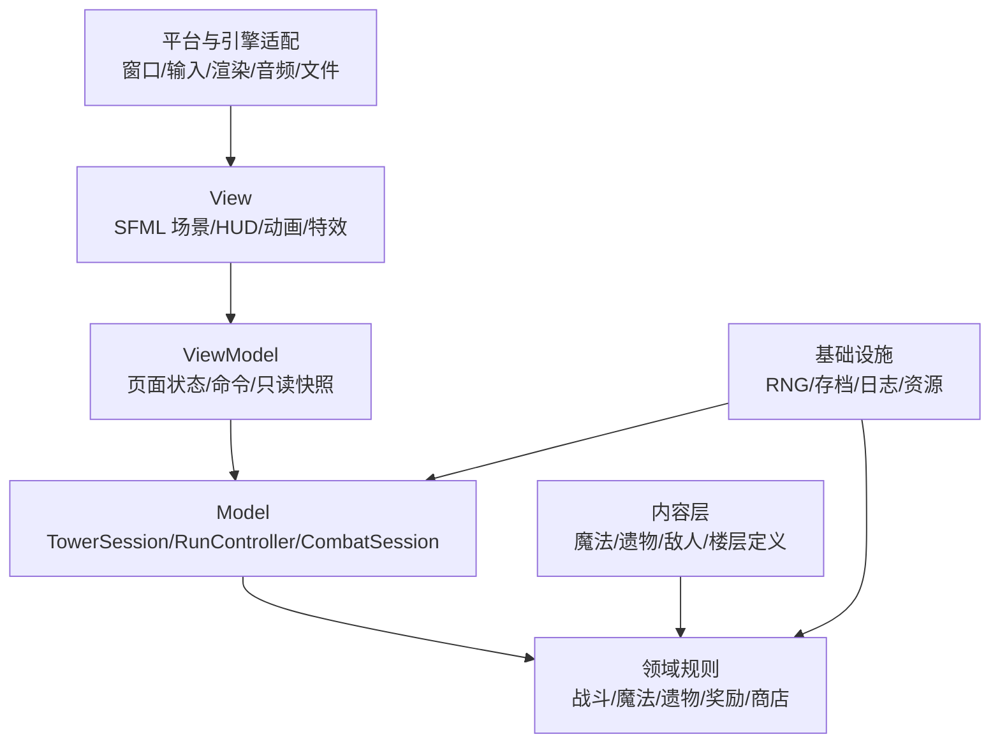
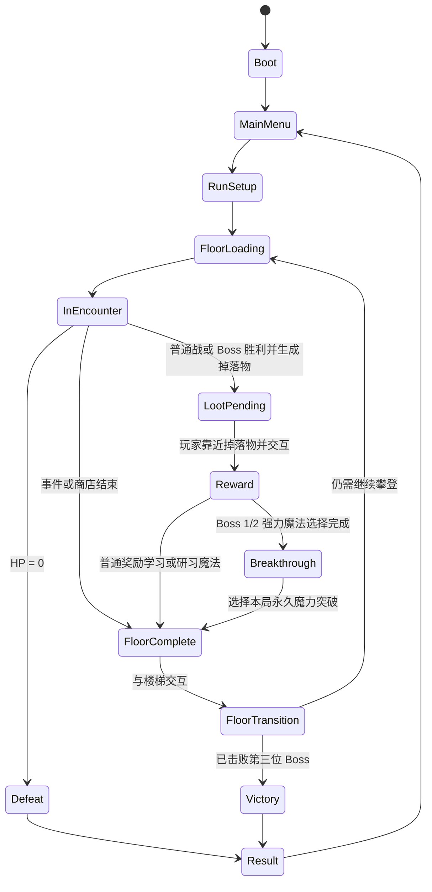

# 《秘法高塔》（暂名）系统架构

## 1. 文档目的

本文定义玩法逻辑架构与 SFML 平台边界，用于指导后续 C++20 实现。项目已选择 SFML 3.1.0 与 CMake，当前已经存在窗口/输入适配、纯 C++ 玩家控制器、最小战斗会话和 CTest 测试目标；音频、内容数据格式和完整测试框架仍需后续决定。文中的未创建目录仍属于计划边界。

魔法表现的动画模板、像素资源规格和视觉事件扩展建议由 `MAGIC_VFX_DESIGN.md` 定义。该表现文档不得成为伤害、控制、范围或冷却的第二权威来源。

法术定义同时声明效果类别、生成形状和数值范围。施法后由 `CombatSession` 产生包含法术 ID、权威 AABB、持续时间的只读 `SpellEffectView`；SFML 层不重新计算范围或伤害。当前 `SpellEffectAnimator` 依据该快照选择像素图集并以 `duration - remaining` 计算帧。权威 AABB 只提供命中区域和空间参考，不能强制视觉贴图缩放到同样尺寸；每种法术可独立选择视觉尺寸、锚点、等比缩放和重复铺设，且允许效果超出判定范围。矩形范围框只在没有对应贴图或贴图加载失败时作为回退，正式预警需要独立的地面纹理，不能让调试框常驻在动画下方。后续粒子与分阶段视觉事件仍应沿用这条领域到表现的数据流。

一次成功施法始终携带定义中的基础伤害，`SpellCastResult::hit` 只表示预览目标是否相交，不能用于把整次施法伤害清零。`CombatSession` 必须逐个检查所有存活敌人与权威范围是否相交，再对每个实际命中的目标应用伤害；这保证多敌人战斗中敌人容器顺序不会改变命中结果。

## 2. 架构目标

- 支持一层一层加载和卸载，不常驻全部塔层。
- 用确定性种子重现楼层、遭遇、奖励和商店结果。
- 将玩法规则与渲染、输入、音频、文件系统解耦。
- 支持魔法、遗物、敌人和事件的数据驱动扩展。
- 让伤害、回血、冷却、奖励和进度等纯规则可单元测试。
- 先完成单线程垂直切片；只有性能测量证明需要时才增加并行复杂度。

## 3. 分层结构



项目采用不依赖第三方库的 C++ MVVM：View 把设备输入映射为命令并绑定只读快照；ViewModel 保存页面状态、解释 UI 命令并调用 Model；Model 持有权威玩法状态与规则。依赖方向朝向稳定的玩法规则，Model 和领域层不直接调用 SFML、音频或键盘 API。

## 4. 核心系统与职责

| 系统 | 责任 | 不负责 |
|---|---|---|
| `SfmlApplication`（View） | 窗口主循环、绘制、动画和输入采样 | 保存页面选择或修改玩法规则 |
| `ApplicationViewModel` | 管理 Start/Playing/Pause/Result，解释顶层命令并拥有当前 Model | SFML 绘制与战斗数值计算 |
| `LoadoutViewModel` | 管理 Tab 开关、页签、光标和装备命令，生成构筑快照 | 持有已学魔法、遗物或装备的权威数据 |
| `CombatFeedbackViewModel` | 比较连续权威快照，生成短生命周期的闪白、伤害数字和确定性镜头偏移 | 修改 HP、判定无敌或反向影响战斗模拟 |
| `SpellAcquisitionViewModel` | 在奖励已经结算后以统一 `3×` 倍率管理参考实现的 713 帧注册、384 帧后的循环网络、190 帧星爆和信息落版时序，并在演出期间消费顶层输入 | 发放奖励、装备魔法或调用 SFML 绘制 API |
| `TowerSession`（Model） | 把战斗结果、奖励、楼梯和下一层串成可执行流程，并提供装备命令 | 保存 UI 页签/光标或绘制 SFML 图形 |
| `RunController` | 创建/结束本局，持有本局种子、玩家构筑与 Boss 进度 | 绘制 HUD |
| `FloorController` | 生成、加载、激活、结算和卸载一层 | 直接决定魔法伤害 |
| `EncounterDirector` | 按楼层类型启动普通战、事件、商店或 Boss | 保存渲染对象 |
| `CombatWorld` | 战斗实体、命中、伤害、死亡和战斗结束条件 | 奖励界面 |
| `EnemyController` | 敌人追击、前摇、攻击有效帧、后摇和攻击序列 | 直接修改玩家 HP |
| `PlayerState` | HP、金币、普通/Boss 已学魔法、三槽普通装备、终极槽、遗物集合 | 输入设备读取 |
| `SpellSystem` | 施法条件、效果触发、槽位与冷却状态 | UI 图标布局 |
| `RelicSystem` | 注册修正与触发器，处理叠加和防重入 | 直接修改表现动画 |
| `RewardSystem` | 从对应池生成不重复候选并应用选择 | 商店交易 |
| `MerchantSystem` | 商品生成、价格校验、购买事务 | 普通战奖励 |
| `FloorGenerator` | 从种子和楼层上下文生成可验证楼层描述；平台、出生标记与可达性契约见 `MAP_DESIGN.md` | 直接创建引擎节点 |
| `ContentRegistry` | 加载和查询内容定义，校验 ID 与引用 | 持有本局进度 |
| `SaveService` | 设置、解锁和可选本局快照的序列化 | 决定游戏规则 |
| `AssetService` | 资源定位、加载、缓存和卸载策略 | 内容平衡 |

当前垂直切片由 `ApplicationViewModel` 持有可选的纯 C++ `TowerSession` Model，后者持有 `RunController` 和至多一个 `CombatSession`。`main.cpp` 只是创建并启动 `presentation::SfmlApplication` 的薄入口。SFML 消息循环固定为事件泵、输入采样、ViewModel 更新、动画更新和统一帧渲染；View 不再调用顶层 Controller，也不保存暂停菜单或构筑页面状态。View 实现按职责拆为 `views/UiPrimitives`（文字、卡片、血条和菜单）、`views/ScreenViews`（奖励、商店、事件、构筑和特殊楼层）、`views/CombatView`（战斗场景、敌人贴图、Boss 对话）与 `views/SpellAcquisitionView`（场景内光球、工程诊断窗、注册几何网络、星爆和信息落版）；`PlayerAnimator` 和 `EnemyAnimator` 仅根据只读战斗快照推进表现帧，`SfmlApplication.cpp` 只保留资源组装、页面路由和主循环。窗口创建后先提交一帧资源准备画面，再同步建立当前课程版本的纹理缓存；运行期间窗口标题只有内容变化时才写入操作系统，不能在每帧重复调用平台 API。

`ApplicationViewModel`、`LoadoutViewModel` 与 `SpellAcquisitionViewModel` 是有状态 ViewModel；`ApplicationSnapshot`、`LoadoutSnapshot`、`RewardViewModel`、`MerchantViewModel`、`SpellAcquisitionSnapshot` 和装备槽投影是 View 的只读绑定对象。构筑 ViewModel 只拥有开关、页签、分区和光标等 UI 状态，通过 `TowerSession::equipRegularSpell/equipUltimateSpell` 命令修改 Model；已学魔法、遗物、槽位和冷却仍只有 Model 能权威持有。获取演出 ViewModel 只在检测到已学列表增长后启动，保存内容 ID 和表现时间；奖励已经由 Model 原子结算，演出不能重复发放或自动装备。演出期间 Model 不推进，`PlayerAnimator` 由表现层覆盖为一次性的 `Pickup` 姿态并停在末帧，避免复用冻结前残留速度而显示跑步。`CombatFeedbackViewModel` 是仅持有表现寿命的 ViewModel：它读取相邻两帧 `PlayerStateView/EnemyStateView` 的权威 HP 差值，产出目标闪白、飘字、命中扩散环、纯视觉击退、确定性镜头偏移和短命中停顿请求，并在楼层切换时重置。事件、战斗 HUD 和特殊楼层面板目前仍读取 Model 的只读快照，后续按同一边界迁移。

## 5. 状态所有权

```text
SfmlApplication (View，无玩法状态所有权)
└── ApplicationViewModel
    ├── ApplicationScreen / PauseMenuItem
    ├── LoadoutViewModel
    │   └── Open / Page / Section / Selection（仅 UI 状态）
    └── TowerSession (Model，仅在本局期间存在)
        ├── RunController
        │   ├── PlayerProgress / SpellMasteries / BreakthroughRanks / EquippedSlots / Relics
        │   └── floorIndex / bossesDefeated / runSeed
        ├── FloorScheduler
        └── CombatSession 或 ExplorationPlayer（仅当前层）
```

- `RunController` 是本局状态的唯一所有者。
- `FloorController` 的生命周期不得超过当前楼层。
- UI 和表现对象只能观察或提交命令，不能成为 HP、金币、冷却或奖励的权威来源。
- 不使用可变全局变量或隐藏单例保存玩法状态。

## 6. 顶层状态机

`ApplicationViewModel` 持有可选的 `TowerSession` 并管理 `Start/Playing/Pause/Result` 页面。四个页面的命令分别由 `handleStart/handlePlaying/handlePause/handleResult` 处理，避免顶层输入与玩法更新堆积在一个 Controller 分支中。暂停页由 `PauseMenuItem::ReplayCurrentFloor/SaveAndExit` 保存当前高亮项；确认后才重开本层或暂退。暂退到 Start 时保留同一个 Model 供 Continue 使用，但当前没有磁盘序列化。`TowerSession` 在每层调度前保存 `RunController` 与 `FloorScheduler` 快照，本层重开时恢复快照后重新生成同一种子楼层。

事件/商店验收入口使用 `TowerSessionConfig::firstFloorTypeOverride` 显式覆盖首层类型；正式新局不设置该字段，仍由 `FloorScheduler` 的确定性随机流和保底规则决定楼层。商店预览使用配置副本提供测试金币，不修改正式配置。预览入口只改变测试会话，不在调度器中加入环境相关的随机分支。



`LootPending` 将战斗输入与奖励选择输入隔离：战斗结束后保留当前地图和玩家位置，掉落物位于最后敌人的死亡位置，只有空间相交并提交交互才进入 `Reward`。`LootBookAnimator` 加载 `128×96`、8 帧的透明像素图集，以独立表现时钟循环书页、悬浮高度和魔力光晕，不改变权威交互 AABB；成功打开奖励时，`TowerSession` 命令 `CombatSession` 将玩家落到当前 `WorldBounds` 地面并清除残余速度、冲刺、飞行和硬直，避免模态页面冻结空中状态。奖励和楼梯交互是独立状态，防止重复发放奖励或重复过层。选择奖励会先由 Model 转入 `FloorComplete` 并写入已学列表，再由 `SpellAcquisitionViewModel` 启动不属于 Model 流程状态的获取覆盖层；该层消费全部顶层输入但不回滚已结算奖励。获取演出开始 0.35 秒后，覆盖层将 `Space` 解释为仅完成表现时间轴而不关闭结果页的跳过命令，避免输入穿透和说明丢失。`LoadoutOverlay` 同样不是 Model 的流程状态，而是 `LoadoutViewModel` 可从 `InEncounter`、`LootPending`、`Reward` 或 `FloorComplete` 打开的覆盖层；打开时由它消费 UI 输入，Model 的玩法时间不推进。覆盖层内部由 `LoadoutPage::Spells/Relics` 区分两页；装备通过显式 Model 命令提交，遗物页只绑定本局遗物快照。

奖励结算的现行补充规则是：普通候选既可能是未学魔法，也可能是已学魔法的下一阶研习；Model 根据 `PlayerProgress::spellMasteries` 原子地学习或升级，然后进入 `FloorComplete`。Boss 1/2 的强力魔法结算后进入 `Breakthrough`，选择 `Power/Haste/Defense` 之一才完成楼层；Boss 3 不再突破。`SpellAcquisitionViewModel` 同时监听已学列表增长和权威阶位增长，因此研习沿用注册演出但不能再次发放内容。`ProgressionSystem` 是阶位上限、研习倍率、招牌效果说明和突破倍率的唯一规则来源；ViewModel 只投影目标阶位与完整说明。

奖励联动提示由 `RewardSystem::spellSynergyHints` 从同一份确定性联动目录生成，输入是候选 ID 与 `PlayerProgress` 的已学普通/Boss 魔法。目录保存真实施法顺序、触发条件和追加数值，并同时供进阶奖励的联动候选筛选使用；`RewardViewModel` 只解析搭档名称，View 不允许自行用魔法 ID 猜测组合规则。为保证三张卡在 720p 界面内可读，每张卡按目录顺序最多投影三组当前已拥有的联动。

## 7. 战斗与时间

### 7.1 更新模型

- 输入层把设备状态转换为 `PlayerIntent`，例如移动轴、跳跃、基础攻击、固有冲刺、施放普通槽位 0–2、施放终极槽、交互。
- 玩法层以统一的时间步更新移动、冷却、命中与状态机。
- 当前课程原型直接使用像素空间，权威基线为 `1280×720` 窗口、`42×64 px` 主角碰撞体和身体前缘外 `58×36 px` 普通攻击判定。所有距离仍须集中定义，不能在 UI 和玩法系统分别写死；若未来改为分辨率无关单位，必须通过单独架构决策整体迁移。
- 如果使用可变帧率，所有连续时间逻辑必须使用 delta time；如果物理库要求固定步长，则渲染与模拟分离。
- 暂停状态停止玩法时钟，但 UI 时钟可继续。

### 7.2 伤害与修正

已使用集中式 `DamageResolver`：输入伤害来源、攻击序列、基础伤害、来源/目标倍率、固定减伤与阻挡状态，输出一次不可变的 `DamageResult`。结果包含解析伤害、实际 HP 损失、前后 HP、致死、阻挡和重复序列状态。表现层根据结果播放数字、音效和硬直，不自行重新计算。

基础攻击、三个普通魔法槽、终极槽、敌人技能、敌人碰撞与主动生命消耗均通过该入口。Resolver 按伤害来源分别记录最后结算序列，相同来源和序列不会重复扣血，不同魔法槽之间保持隔离。`RelicRuntime` 在战斗开始时从本局遗物快照建立限时状态和开场触发，并只在明确的来源或目标倍率阶段修正伤害；UI 不重新计算这些效果。

玩家方的所有敌对伤害再经过 `CombatSession::resolvePlayerDamage`：入口先合并攻击自身的阻挡标记与权威受击无敌计时器，只有 `DamageResult::appliedDamage > 0` 才递增 `PlayerStateView::hurtSequence` 并启动 `0.60 秒`窗口。完全由护盾吸收或其他无敌挡下的请求不会启动窗口。计时器与伤害判定属于 Model；`PlayerAnimator` 只用受击序列重播 Hit 动画，`CombatFeedbackViewModel` 只用 HP 差值生成视觉反馈，二者都不能延长无敌时间。

命中停顿不写入 Model，也不改变已经产生的 `DamageResult`。`CombatFeedbackViewModel` 按一次权威 HP 差值选择轻/中/重停顿参数，同一帧只保留最长值；SFML 应用壳在活动战斗中通过 `combatDeltaSeconds()` 将 Model 和角色动画的 delta 暂时置零，同时仍用真实 delta 更新反馈 ViewModel。由于被冻结时间不在后续帧补算，攻击序列、持续伤害、AI、无敌计时和技能冷却都不会因表现停顿发生重复结算或时间跳跃。敌人的 7 px 命中位移只修改绘制位置，不修改 `EnemyController` 碰撞体或 B 负责的 AI 行为。

当前原型由 `EnemyController` 产出带递增序列号的攻击有效帧。技能冷却是与 `Chase` 并行推进的独立计时器，开场初始化为定义 CD 的一半；进入 `Windup` 时锁定朝向，只有回到 `Chase` 后才能重新面向玩家；`Windup/Active` 结束后立即回到追击并启动完整 CD。追击停止点按双方 AABB 水平边缘间距计算，有碰撞伤害者为 20 px，无碰撞伤害者为 42 px；技能触发距离另按“玩家宽度至少一半进入技能区域”计算，二者不得共用一个中心距离。`CombatSession` 负责多敌人序列隔离、扣除 HP 并调用玩家受击反应。非位移技能可通过 `EnemyStateView::skillEffectBounds` 向表现层提供只读矩形区域，表现层不自行推导射程；阿乌拉支配也公开与结算一致的身前预警区。

海蒙的固定雾区、敌人隐匿进度和可受伤性由 `CombatSession` 权威维护，View 只读取 `concealmentProgress` 调整透明度、隐藏血条并绘制雾区；完全隐匿同时关闭所有伤害与敌人碰撞伤害。雾区 AABB 在施法完成时写入 `EnemyRuntime`，此后不再由海蒙位置推导。魔族战士的移动斩击同样是战斗域拥有的临时实体，具有独立 AABB、方向、剩余距离和伤害序列，表现层只消费只读特效快照。大型鸟魔物的突袭目标在进入前摇时锁定，由 `EnemyController` 推进下降、触地和返航阶段。

第三幕石像鬼的激光由 `CombatSession` 维护为带起点、终点、持续时间和伤害序列的临时线段实体，领域层使用带厚度的线段与 AABB 相交测试完成命中，View 仅按 `SpellEffectView::rotationDegrees` 绘制。三头魔物的生命阶段与自愈阈值、剑之魔族对玩家魔法伤害的闪击反应均属于战斗域；表现层不得从血条或受击动画反推这些规则。

雷沃戴的五组独立冷却、固定技能优先级、招架窗口、反击突进和二阶段标志均属于其 `EnemyRuntime`，不由 ViewModel 计时。所有敌方剑气复用战斗域临时投射物结构，并携带自身 AABB、初始/剩余距离、伤害和唯一序列。`EnemyConfig::attackDistance` 只决定起手距离，`attackRange` 仍决定近战判定框，因此带投射物的技能可按最远距离的三分之二起手而不扩大瞬时近战伤害。第一次越过 5 HP 阈值由统一敌人伤害入口截断，阶段对话完成后才恢复至半血并解除过渡期免伤；死亡台词完成前不得提交 `CombatResult`。

拥有两个技能的普通敌人继续使用一个 `EnemyController` 管理基础追击与主要攻击，并由该敌人的 `EnemyRuntime` 保存第二技能的独立冷却、前摇和有效状态；第二技能执行期间暂停 Controller，避免两个技能重叠。混沌花的昏睡层数属于玩家本场战斗状态并集中封顶为 5；冰原狼猛扑保存前摇时锁定的方向并通过 Controller 的受控位置接口更新抛物线。

剑之乡专属遗物仍以稳定内容 ID 存入本局遗物集合，但不加入 `RelicMerchantCatalog`。勇者之剑通过 `DamageRequest::flatReduction` 修正 `EnemyContact`；真-勇者之剑只在 `DamageResult::appliedDamage > 0` 后产生一次范围反击，避免黑冲无敌、护盾或减伤令实际伤害归零时仍触发，也不得递归响应自身伤害。

阿乌拉的“不死大军”是 `CombatSession` 拥有的 Boss 召唤计时器，而不是表现层生成对象：开场和每次 12 秒触发均创建两个拥有独立 AI、HP、伤害序列与血条的无头骑士 `EnemyRuntime`。支配使用锁定朝向后的身前 `420×180 px` AABB、0.8 秒前摇和单次攻击序列结算，基础伤害为 0，命中后提交 1 秒控制；首次施放只绕过女神加护与普通控制抗性，空间相交、黑冲和法术无敌始终在应用控制前判断。首次支配后启用的灵魂断头台由 `EnemyRuntime::secondaryCooldown`、`specialWindup` 和 `specialActive` 驱动：开始前锁定玩家位置为 `192×420 px` AABB，0.9 秒后只结算一次 22 点伤害，区域不再追踪；其 9 秒独立冷却只允许在 `Chase` 且未受控制时启动。`EnemyStateView` 只投影权威范围、阶段和归一化进度；表现层把固定框架和运动刀刃作为两张独立纹理加载，按投影范围缩放框架并按投影进度驱动薄刃完成全高下落，素材缺失时使用程序化结构回退，不复制任何命中公式。

红镜龙原型当前处于延期状态，不得由楼层调度器生成。其爪击与吐焰实验代码暂时保留以便后续恢复，但不属于当前可玩内容或交付验收范围。Boss UI 仍根据 `EnemyArchetype` 判断主 Boss，不能仅凭楼层类型把召唤物也画成固定 Boss 血条。

建议把遗物修正分为明确阶段：

1. 施法/攻击前置条件。
2. 来源数值修正。
3. 目标数值修正。
4. 最终伤害与 HP 变化。
5. 命中后、受击后、击杀后事件。

事件分发必须防止无限递归；同一效果链应携带事件 ID、深度或已触发标记。

水镜恶魔最终战的阶段、复制体生命和技能冷却全部由 `CombatSession` 持有。水镜恶魔本体仍经过统一敌人伤害入口，但该入口以明确的目标阻挡规则拒绝直接伤害；第一阶段复制体全部死亡后，领域层负责扣除本体一半生命、创建芙莉莲复制体并启动暂停对话，不能由 View 根据血条反推阶段。斜向光束复用领域层线段实体，剑气复用带独立速度的敌方投射物；破灭之雷使用“每 0.8 秒锁定一次位置的风暴调度器 + 0.4 秒延迟落雷”，地狱业火使用仅覆盖基础地面的限时伤害区域。菲伦复制体的连射由战斗种子和连射序号确定，不使用环境随机数。

### 7.3 冷却

- 冷却状态属于已装备槽位或魔法实例，二者必须在技术决策中明确。
- 基础数据包含持续时间、是否受遗物缩减、开始时机与切槽行为。
- UI 从权威冷却状态读取 `remaining / duration`。
- 暂停、楼层过渡与奖励界面是否推进冷却必须全局一致；建议仅在可战斗状态推进。
- 三个普通槽保持独立冷却；终极槽另持有一条基础 `18 秒` 的公共冷却，Boss 魔法定义不得各自保存可被换装刷新的运行时冷却。
- 普通冲刺的 0.6 秒冷却、黑冲的 1.5 秒独立充能及本次冲刺类型均归 `PlayerController` 所有，不属于 `SpellSystem` 内容。`CombatSession` 只读取 `isShadowDashing()` 决定无敌、标记和遗物触发，UI 只读取公开的只读运行时状态。旧防御 ID `1007` 已退役，不再拥有输入或战斗运行时状态。
- 终极公共冷却在战斗实例开始时归零，成功施放后启动；战斗中更换 Boss 魔法只替换内容 ID，不替换该冷却实例。

### 7.4 当前 M1 战斗契约

`CombatSession` 是 `CombatWorld` 的最小垂直切片，不是最终敌人或伤害框架。它只依赖纯 C++ 类型，SFML 主循环负责把键盘映射为意图并绘制只读状态。

- `SfmlInputMapper` 将跳跃、攻击、施法、交互和菜单等一次性动作从 SFML `KeyPressed` 事件缓冲到下一次模拟更新，防止低帧率下短按发生在两次实时轮询之间而丢失；窗口关闭系统按键重复。水平与垂直移动轴仍读取实时键盘状态，以保留持续按住的控制语义。
- 内置像素字体把一次文本调用中的所有亮点合并为一个三角形顶点数组提交，UI 不得为每个字体像素单独产生一次绘制调用。该优化只影响表现性能，不改变奖励选择或其他领域状态转换。
- `SpellCardArt` 独立加载 `assets/spell_cards/<spell-id>.png` 中的 33 张方形卡面，并以同一内容 ID 在奖励、商店、Tab 配装页和 HUD 槽位中绘制；它不读取或复用 `SpellEffectAnimator` 的战斗图集。卡面插画和 Boss 金色边框只属于表现层；魔法类别、可装备性、伤害、范围与冷却仍只读取领域定义和运行时快照。
- `CombatRequest` 输入遭遇 ID、种子、玩家出生点、敌人实例列表、场地边界、玩家初始 HP 和金币基础奖励。敌人列表为空时仍支持旧单敌人字段，供小型领域测试使用；正式普通楼层传入三个敌人实例，Boss 楼层传入一个。
- `CombatResult` 只报告胜负、原遭遇 ID、击杀数、应发金币和战斗结束后的玩家 HP；它不直接修改 B 拥有的本局资源或楼层进度。
- `PlayerStateView` 和 `EnemyStateView` 是表现/UI 可读取的快照。`CombatSession::enemyStates()` 返回每个敌人的类型、位置、碰撞尺寸、HP 和技能阶段，UI 据此在普通敌人头顶绘制独立血条；Boss 继续使用右上角血条。实时主循环使用 `populateEnemyStates/populateSpellEffects` 填充跨帧复用的容器，同一帧的反馈、动画和 View 共享同一份投影，避免重复构造快照和持续堆分配；返回 vector 的旧接口保留给测试和非热路径调用。
- `PlayerStateView` 额外公开权威速度、基础攻击序列号、成功施法序列号、受击序列号与受击无敌剩余时间。SFML `PlayerAnimator` 只用这些只读字段选择或触发动画；一次性动画不得反向延长攻击有效帧、施法冷却、冲刺时间、无敌时间或受击控制。玩家精灵统一为 `128×96` 帧并以 `(64, 92)` 脚底锚点对齐 `42×64` 权威碰撞体，向左朝向通过表现层水平镜像实现。
- `ShadeChargeAnimator` 只读取投影到 `PlayerVisualState` 的 `shadowDashChargeRemaining` 与 `shadowDashing`：它记录上一帧是否仍在充能，只在剩余时间由正数跨到零时，以最多 8 个确定性粒子模板播放一次约 0.35 秒的向胸口收束提示；充能期间、就绪等待期间和开局默认就绪状态均不持续绘制。HUD 不再重复绘制独立充能条；它不拥有或修改 1.5 秒充能、无敌和标记规则，暂停、构筑与魔法获取覆盖层只冻结其表现时钟。
- `SpellEffectAnimator` 在表现层持有 32 套法术图集纹理和 33 个当前法术 ID 的布局映射。图集帧尺寸、锚点与播放速度来自经审核的 `assets/spells/processed/manifest.json`，运行时代码不读取或修改领域数值；CMake 将标准化图集复制到可执行文件旁的 `assets/spells/`。每个映射显式选择固定中心、施法者脚底、目标地面、前方端点、地面铺设、牵引线、单光束、三重光束、追踪弹组或多火柱布局，并只允许等比缩放图集。瞬发效果的生命周期不得短于 `frameCount / framesPerSecond`，持续效果必须完整播放入场帧、循环中段和退场帧；二次触发的魔像碎裂与镜阵响应也遵守同一规则。当前朝向型法术读取玩家的只读朝向进行水平镜像，正式拆分弹体与命中阶段时再由 `SpellVisualEvent` 携带施法瞬间朝向。
- `EnemyStateView` 还公开锁定后的朝向。SFML `EnemyAnimator` 按敌人类型和 `windingUp/attackActive` 选择四帧 idle/windup/attack 图集行并水平翻转；状态切换会从该行首帧开始，待机以 4 FPS 按 `0-1-2-3-2-1` 往返播放，前摇以 9 FPS 推进，短攻击以 30 FPS 播放。动画器比较相邻只读快照的水平位置，只在实际位移时为拥有 `walk.png` 的敌人播放 10 FPS 行走循环；当前无头骑士使用八帧重甲步态，停下即回到待机，表现检测不能写回 AI 速度或位置。离线处理按每帧可见高度独立缩放，攻击与前摇不得低于对应敌人待机高度的 90%，再以源格中心和旧姿势地面线对齐，并用三倍宽透明画布容纳武器和拖尾，避免横向攻击把角色本体缩小、原地漂移或在循环边界突跳；这些表现参数不得反向改变领域碰撞箱、攻击有效时间或伤害。特殊跳跃、召唤、登场和死亡姿势优先于通用图集。资源由 CMake 复制到可执行文件旁的 `assets/`。
- 每次基础攻击都有递增序列号，命中目标后记录序列号，保证活动帧跨越多个更新时不会重复结算。
- `Health`、攻击计时和 AABB 相交判断位于领域层；窗口、键盘和 SFML 图形类型不得进入这些接口。

B 可在流程测试中直接构造 `CombatResult`，但不得另建同名假契约。`RunController` 当前会校验阶段、楼层类型、遭遇 ID、金币与剩余 HP，再原子地推进奖励状态；过期或重复结果不生效。事件和商人层通过 `completeNonCombatFloor()` 完成，不生成普通战斗奖励。A 后续扩展字段时须保留已有语义，或按团队接口变更规则先同步。

## 8. 魔法与遗物数据模型

内容数据格式尚未选择，但逻辑字段应稳定。

```text
SpellDefinition
- id
- displayNameKey
- category/tags
- cooldownSeconds
- castPolicy
- targetingPolicy
- orderedEffects[]
- presentationId
- rewardTier

SpellMastery (per run)
- spellId
- rank (I/II/III, capped by act)

BreakthroughRanks (per run)
- power
- haste
- defense

RelicDefinition
- id
- displayNameKey
- tags
- stackingPolicy
- modifiers[]
- triggers[]
- presentationId
```

- 内容定义只保存配置，不保存每局变化的冷却或计数。
- 本局实例状态通过稳定 ID 引用定义。
- `SpellSystem` 从三个普通装备 ID、对应权威阶位和一个可空的 Boss 装备 ID 建立每场战斗运行状态；普通槽实例分别保存剩余冷却，终极运行时独立保存共享剩余冷却。`ProgressionSystem` 在构造战斗请求时提供研习与魔力突破修正，`CombatSession` 再组合直接伤害、持续区域、限时祝福和主动生命消耗效果，并向表现层暴露只读持续时间与实际冷却状态。
- 配置加载时验证重复 ID、缺失引用、非法数值和无法识别的效果类型。
- 新效果应优先组合已有原子效果；只有无法表达时才增加新的行为类型。

## 9. 确定性随机系统

### 9.1 种子层级

```text
runSeed
├── floorSeed(runSeed, floorIndex)
│   ├── layout stream
│   ├── encounter stream
│   ├── reward stream
│   └── merchant stream
└── event stream
```

不同内容使用独立随机流，避免“新增一个装饰物随机数”改变整层奖励结果。日志和失败报告应记录 `runSeed`、`floorIndex`、楼层类型和内容版本。

当前纯 C++ 实现使用固定的 64 位 SplitMix 派生函数生成楼层种子与各内容通道种子；该算法属于可重现契约，调整时必须同步更新固定种子测试。

正式可执行程序在进程启动时组合系统随机源与高精度时钟生成一个 64 位本局种子，并在游戏窗口标题中显示。该种子在本局内保持不变，楼层、一级 Boss、事件、商店和奖励仍由确定性子流派生；自动化测试继续显式传入固定种子。

### 9.2 楼层生成流程

1. 根据进度计划确定 Boss/普通/事件/商店类型，并应用保底规则。
2. 从楼层模板池选择主题与布局参数。
3. 生成出生点、主要空间、遭遇区域和出口。
4. 验证入口到出口可达，关键平台满足玩家当前移动能力。
5. 填充敌人、交互物和奖励上下文。
6. 验证失败时使用受控重试或回退模板，并记录原因。
7. 将纯数据 `FloorDescriptor` 交给引擎适配层实例化。

当前 `FloorScheduler` 的正式默认节奏为每五层一个 Boss，Boss 固定出现在第 5、10、15 层，完整流程共 15 层；Boss 层优先且不消耗普通候选层的保底计数。`floorsPerBoss` 仍可在测试和快速预览配置中显式缩短。其他楼层由 `encounter` 随机流确定，并通过可配置间隔保证商店和事件出现。商店库存使用独立 `merchant` 随机流，新增楼层布局随机数不会改变商品。

`ArenaLayout` 目录现以稳定 ID `110～115`、`210～215`、`310～315` 描述三幕纯平地安全房、普通竞技场与 Boss 房。`FloorController` 只使用 `RandomStream::Layout` 在当前幕普通竞技场池中选择 ID；事件和商店直接选择当幕 `SafeRoom`，Boss 直接选择专用房。`TowerSession` 将当前布局的静态单向平台复制进 `CombatRequest`，`PlayerController` 负责从下方穿台、下落落台、离开边缘，以及仅在站立于单向平台时响应“下方向 + 跳跃”的主动穿台；基础地面始终不可穿透。`ArenaLayout::enemySpawnPoints` 以审核过的平台几何稳定派生三类出生标记：三个主地面点、每个平台一个高台点和一个空中点。`TowerSession` 让鸟形飞行敌人优先使用空中点，让 Richter、Denken 这类能从高处向地面投放技能的远程施法者优先使用高台点，其余近战仍使用主地面点；高台点同时携带该平台的水平 lane 与顶面高度，`CombatSession` 在追击、击退和牵引时统一使用该 lane，避免敌人走出平台后悬空。首版不让所有地面敌人跨层导航。SFML `ArenaTextures` 在应用启动时一次性持有当前课程版本三幕共六张背景/平台纹理，`ArenaView` 只读取布局主题和平台矩形完成缩放绘制，不重新计算碰撞；纹理缺失时使用程序化场景后备。平台图可向碰撞顶面下方延伸，但权威碰撞仍只来自 `ArenaLayout`。

商店/事件层由 `TowerSession` 持有独立的探索玩家和 NPC 交互覆盖层。商店库存按魔法与遗物分行生成，`TowerSession` 保存当前选中商品 ID/索引并消费菜单方向与确认意图；表现层只负责按类别分行、显示价格和选中状态。成功交易后从活动库存移除商品。事件使用 `Untriggered → Choosing → Result` 状态机，`Result` 保存选择 ID 到本层卸载为止，以便重复查看相同效果。覆盖层关闭不完成楼层，只有玩家到达后方楼梯才提交非战斗楼层完成与过层事务。

## 10. 楼梯过层事务

楼梯交互必须是一次不可重复提交的事务：

1. 校验本层已完成、楼梯已解锁，并且玩家碰撞体处于楼梯交互区域内。
2. 锁定重复输入并进入 `FloorTransition`。
3. 结算未应用的奖励或拒绝过层。
4. 计算并应用 `50% × 已损失 HP` 的恢复。
5. 更新楼层/Boss 进度并保存必要快照。
6. 卸载当前楼层的战斗与表现对象。
7. 从派生种子生成并验证下一层。
8. 加载下一层，设置出生点后恢复控制。

若第三位 Boss 已被击败，第 5 步后转入胜利结算，不再生成普通下一层。

## 11. 内容加载与资源生命周期

- 运行时只要求当前楼层和全局玩家资源常驻。
- 内容定义可常驻；大型纹理、音频、动画和地图资源按幕/楼层管理。
- 楼层卸载后释放不再引用的实体与资源句柄。
- 允许经过测量后后台预加载下一层，但不得影响确定性或让过层失败变成不可恢复状态。
- 资源丢失时在开发构建中报告明确的内容 ID 和路径，不用静默空白替代掩盖错误。

## 12. 存档边界

至少区分三类数据：

| 数据 | 示例 | 策略 |
|---|---|---|
| 设置 | 音量、分辨率、键位 | 可随时保存 |
| 长期进度 | 已解锁内容、统计 | 是否存在待设计决定 |
| 本局快照 | 种子、楼层、HP、金币、魔法、遗物 | 是否支持中途继续待决定 |

存档必须有格式版本。加载时验证范围、ID 和内容版本；无效存档不得导致越界、悬空引用或半加载状态。

## 13. 测试架构

### 13.1 单元测试优先项

- 50% 已损失 HP 的恢复与取整。
- 三个普通槽与一个终极槽的装备、替换、锁定、类别约束和非法索引。
- 冷却开始、推进、暂停和归零。
- 伤害修正顺序和风险收益遗物。
- 普通/强力魔法三选一不重复。
- 商店金币不足、扣款与商品发放的原子性。
- 同一种子生成相同楼层/奖励；不同随机流互不污染。
- Boss 计数与第三位 Boss 胜利条件。

### 13.2 集成测试优先项

- 普通战结束 → 奖励加入已学列表 → 返回原地图 → 靠近楼梯交互 → 回血 → 下一层。
- 任意可玩阶段打开装备栏 → 浏览全部已学魔法 → 明确装备到某一槽位 → 关闭后恢复原阶段。
- 商店购买后金币、库存和构筑一致。
- Boss 胜利只发放一次奖励。
- 任意 Boss 魔法施放后启动同一终极公共冷却，战斗中换装不能刷新它。
- 楼层卸载后没有旧实体继续更新或触发事件。
- 失败状态禁止继续领取奖励或进入下一层。

### 13.3 可玩冒烟测试

每个垂直切片构建至少手动验证：启动、输入、战斗、施法、死亡、奖励选择、装备、商店、楼梯、下一层和退出。

## 14. 性能预算

- Windows 首个目标：稳定 60 FPS，对应每帧约 16.67 ms；最终目标平台变化时重新定义。
- 先用性能工具确认 CPU/GPU/资源瓶颈，再引入对象池、多线程或定制分配器。
- 确定的热路径应避免不必要的逐帧堆分配和全场景扫描。
- 楼层切换的可接受加载时间、内存上限、实体上限和特效上限需在垂直切片中测量后写入预算。

## 15. 计划目录结构

以下结构仅在对应里程碑需要时逐步创建：

```text
Project1/
├── AGENTS.md
├── Project1.slnx
├── Project1/
│   ├── Project1.vcxproj
│   └── src/
│       ├── app/          # GameApp、流程与状态机
│       ├── game/         # 纯玩法领域系统
│       ├── content/      # 内容定义与校验
│       ├── presentation/ # 视图、HUD、表现同步
│       │   └── viewmodel/ # 奖励、商店、构筑与槽位的只读 UI 投影
│       └── platform/     # 引擎/窗口/输入/音频适配
├── tests/                # 独立测试项目，建立框架后创建
├── assets/
│   └── data/             # 数据驱动内容，格式待定
└── docs/
    ├── GAME_DESIGN.md
    ├── ARCHITECTURE.md
    ├── DEVELOPMENT_PLAN.md
    ├── TEAM_WORK_SPLIT.md
    └── decisions/        # 技术决策记录，首次决策时创建
```

## 16. 技术选型结果与替换门槛

SFML 3、C++20 与 CMake 已由 `decisions/0001-sfml3-cmake.md` 接受。当前技术探针覆盖窗口、输入、绘制、纯逻辑测试和 Debug/Release 构建。

如未来提出替换框架，必须重新比较：

- C++20 与 Visual Studio 集成质量。
- 2D 渲染、动画、碰撞、相机和输入能力。
- 内容编辑与热重载效率。
- Windows 打包与后续跨平台成本。
- 可测试性、调试工具和性能分析能力。
- 许可证、二进制体积、维护活跃度和外部依赖风险。
- 是否能合理实现一层一加载、确定性生成和数据驱动内容。

在现有探针通过完整启动冒烟测试前，不批量实现玩法系统。无论是否替换框架，都不把 SFML 或其他引擎类型渗透到领域层公共接口。
