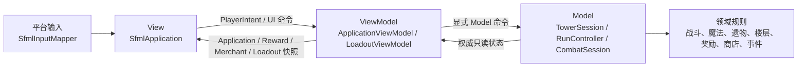
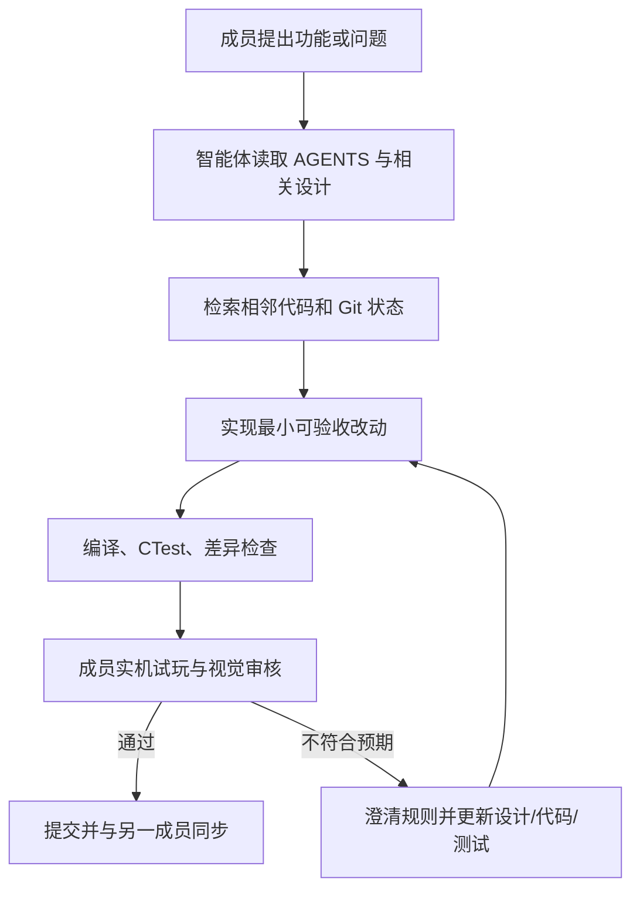
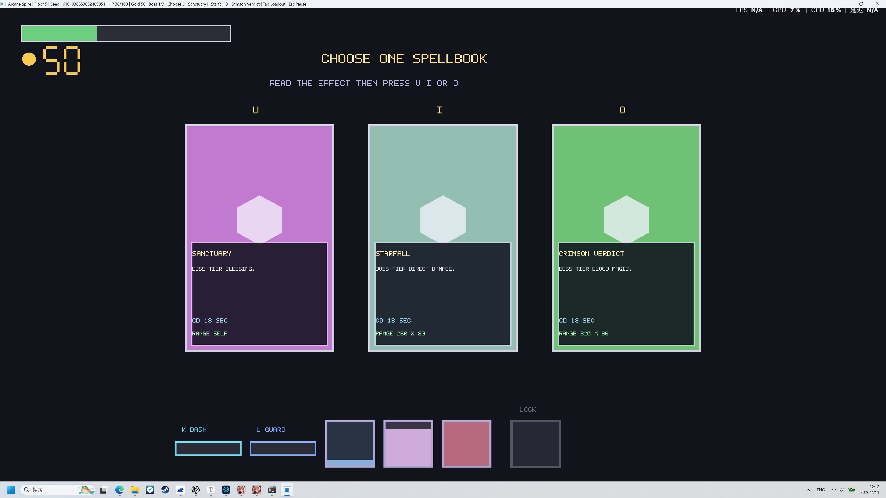
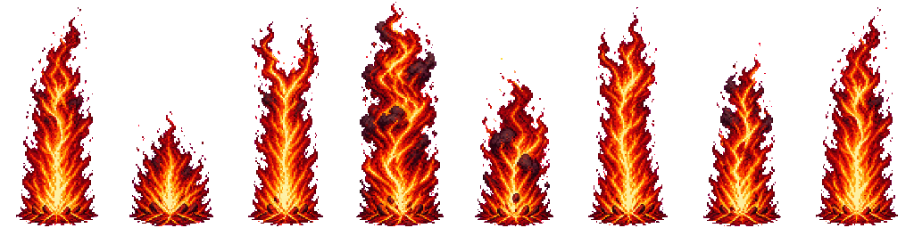

# 中期报告

| 项目 | 内容 |
|---|---|
| 课程名称 | C++ 工程与项目设计 |
| 项目类型 | Windows 平台 2D 动作 Roguelike 爬塔游戏 |
| 开发模式 | 以智能体为主、人类负责目标与验收的双人协作开发 |
| 小组规模 | 2 人 |
| 成员 A | 高鹏皓 3240104811 |
| 成员 B | 方亮 3240105577 |
| 技术栈 | C++20、SFML 3.1.0、CMake、Visual Studio、CTest、Git/GitHub |

## 摘要

本项目拟开发一款 Windows 平台 2D 动作 Roguelike 爬塔游戏。玩家从塔底出发，在单次只加载一层地图的前提下，经历普通战斗、事件、商店和 Boss 楼层，通过收集魔法与遗物逐步形成构筑，并在第 5、10、15 层依次挑战三位 Boss。击败第三位 Boss 后获得本局胜利。

项目采用“以智能体为主”的开发模式：两名成员负责提出目标、冻结规则、检查实机效果和决定取舍；Codex 智能体负责阅读约束、分析代码、提出实现方案、编写与修改 C++、生成测试、执行构建、分析 Git 变更、维护设计文档以及辅助生产像素素材。仓库根目录的 `AGENTS.md` 作为智能体统一约束入口，游戏设计、架构、开发计划、分工和交接文档作为产品事实来源。每次功能调整均按照“需求描述 - 智能体实施 - 编译测试 - 人类试玩 - 反馈修正”的闭环进行。

截至中期节点，项目已有 51 次 Git 提交，其中两个开发账号分别贡献 21 次和 30 次；仓库包含 65 个 C++ 源文件/头文件，约 9855 行 C++ 代码。当前已经打通战斗、空间掉落、奖励选择、装备、楼梯、跨层恢复、商店、事件和 Boss 进度等主要流程，实现 24 本普通魔法、9 本 Boss 魔法、24 件普通遗物和 2 件事件遗物，并建立 5 个 CTest 测试入口。最近一次 Debug 验证中 5/5 测试通过。项目已经形成可玩的纵向切片，但音频、磁盘存档、完整三 Boss 差异化、MVVM 剩余快照边界、数据驱动内容和系统化真人试玩仍需在后半程完成。

## 1. 项目需求与范围

### 1.1 项目目标

项目的核心目标不是简单堆叠敌人与技能，而是完成一个可重复游玩的构筑闭环：

1. 玩家进入由本局种子与楼层编号确定的当前楼层。
2. 楼层类型为普通战斗、事件、商店或 Boss。
3. 战斗胜利后在敌人死亡位置生成空间掉落物，玩家靠近并交互后进入奖励三选一。
4. 奖励加入已学列表，不强制替换当前装备；玩家可随时打开构筑界面调整三个普通魔法槽和一个 Boss 终极槽。
5. 玩家回到楼层地图，与楼梯实体交互后进入下一层，并恢复 50% 已损失生命值。
6. 第 5、10、15 层固定为 Boss 层，第三次 Boss 胜利后结束本局。

### 1.2 核心玩法规则

- 主角状态包括 HP、金币、已学魔法、遗物、三个普通魔法槽和一个 Boss 终极槽。
- 普通魔法拥有独立冷却，不使用法力值。
- Boss 魔法只能装备到终极槽，并共享 18 秒公共冷却。
- `K` 为固有冲刺；普通冲刺冷却 0.6 秒，黑冲独立充能 1.5 秒，充满后的下一次冲刺获得无敌和穿敌标记。
- 退役防御动作和稳定 ID `1007` 不再进入内容池。
- 奖励、商店、事件和楼层生成均使用显式确定性随机流，固定种子可以复现。
- 同一时刻只要求一层地图驻留内存，避免一次性加载整座塔。

### 1.3 中期范围判断

| 里程碑 | 当前状态 | 说明 |
|---|---|---|
| M0 技术基线 | 基本完成 | SFML、CMake、VS、CTest、Git 和双人构建流程已建立；音频探针仍延期 |
| M1 战斗沙盒 | 基本完成 | 移动、跳跃、攻击、受击、敌人 AI、魔法、冲刺与统一伤害管线已接入 |
| M2 单层闭环 | 已完成原型 | 战斗到奖励、装备、楼梯、回血、下一层已经连通并有测试 |
| M3 构筑与经济 | 已完成原型 | 魔法、遗物、商店、事件、奖励池耗尽和确定性交易已接入 |
| M4 第一幕切片 | 部分完成 | 阿乌拉 Boss、暂停、失败、Boss 奖励和终极槽已可玩，仍需音画与盲玩打磨 |
| M5 三幕内容 | 进行中 | 15 层与三次 Boss 胜利流程已连通，但 Boss 2/3 差异化与后期内容仍不足 |
| M6 发布打磨 | 尚未开始 | 音频、磁盘存档、性能预算、可访问性、发布包仍待完成 |

## 2. 技术选型与工程方案

### 2.1 技术选型

项目早期比较了 raylib 和 SFML。由于课程强调 C++ 工程设计、模块边界和自研系统，而不是依赖完整游戏引擎，最终选择：

- C++20：实现游戏规则、流程、状态机和测试。
- SFML 3.1.0：提供窗口、输入和 2D 图形；暂未启用 Audio。
- CMake：作为唯一权威构建描述，统一 Visual Studio 2026 与 2022 环境。
- CTest：执行纯 C++ 规则测试与流程集成测试。
- Git/GitHub：进行双人提交、拉取、合并与回归。

### 2.2 当前分层



项目已按课程要求采用纯 C++ MVVM。SFML View 只采样输入、提交命令并绘制；`ApplicationViewModel` 负责顶层页面与暂停命令，`LoadoutViewModel` 负责构筑页 UI 状态与装备命令；`TowerSession`、`RunController` 和领域系统构成 Model，决定伤害、冷却、奖励和交易。奖励、商店、构筑页和装备槽通过只读快照绑定；事件与战斗 HUD 是下一批快照化对象。

由于 SFML 本身不提供 WPF/Qt 式数据绑定，本项目没有为了“框架”额外引入重量级第三方库，而是用可测试的 C++ 类落实 MVVM 协议：View 每帧读取不可变快照，ViewModel 解释页面命令，Model 只暴露玩法查询与显式修改接口。三层职责如下：

| 层 | 当前实现 | 持有的状态 | 禁止承担的职责 |
|---|---|---|---|
| View | `SfmlApplication`、`UiPrimitives`、`ScreenViews`、`CombatView`、动画器 | SFML 纹理、动画播放进度和窗口资源 | 不保存 HP、奖励、装备或菜单权威状态，不重新计算规则 |
| ViewModel | `ApplicationViewModel`、`LoadoutViewModel`、各类只读快照 | 顶层页面、暂停选项、Tab 页签和当前光标 | 不计算伤害、交易、随机奖励和楼层结果 |
| Model | `TowerSession`、`RunController`、`CombatSession` 与领域系统 | 本局进度、当前楼层、战斗、金币、魔法、遗物和冷却 | 不依赖 SFML，不决定文字布局和卡面绘制 |

重构前，顶层 `AppFlowController` 用一个较大的 `switch` 同时处理开始、游戏、暂停和结果页面，`TowerSession` 还保存 Tab 开关、页签、魔法分区与光标。重构后旧 Controller 被删除，四种页面命令分别进入 `ApplicationViewModel::handleStart/handlePlaying/handlePause/handleResult`；所有构筑页 UI 状态移入 `LoadoutViewModel`，装备操作只能通过 `TowerSession::equipRegularSpell/equipUltimateSpell` 提交给 Model。这使页面状态与玩法状态拥有不同且可检查的所有者。

### 2.3 状态所有权

```text
ApplicationViewModel
├── ApplicationScreen / PauseMenuItem
├── LoadoutViewModel（仅 UI 状态）
└── TowerSession（Model）
    ├── RunController
    │   ├── RunContext
    │   ├── PlayerProgress
    │   ├── FloorController
    │   └── RewardOffer
    ├── FloorScheduler
    ├── CombatSession（战斗层存在）
    ├── ExplorationPlayer（事件/商店层存在）
    └── 商店、事件和本层重开状态
```

该结构避免了可变全局状态。战斗通过 `CombatRequest` 启动，通过 `CombatResult` 将胜负、剩余 HP、金币和遭遇 ID 返回流程域；`RunController` 会拒绝过期或重复结果。

### 2.4 View 层内部拆分

MVVM 重构完成后，ViewModel 与 Model 的边界已经明确，但原 `SfmlApplication.cpp` 仍然同时包含像素文字、卡片、商店、事件、构筑、战斗、Boss 对话、资源加载和主循环，共约 1499 行。为避免把 Controller 的职责问题转移成新的“巨型 View”，本阶段继续按变化原因拆分表现代码：

| View 模块 | 当前规模 | 主要职责 |
|---|---:|---|
| `SfmlApplication.cpp` | 约 311 行 | 创建窗口和资源、驱动 ViewModel、路由页面、执行主循环 |
| `views/UiPrimitives.cpp` | 约 390 行 | 像素文字、换行、卡片、血条、装备槽、金币和通用菜单 |
| `views/ScreenViews.cpp` | 约 401 行 | 奖励、商店、事件、构筑、特殊楼层、楼梯和空间掉落物 |
| `views/CombatView.cpp` | 约 419 行 | 战斗场景、敌人贴图、魔法效果、Boss 登场和对话覆盖层 |

拆分以“共同变化的原因”为依据，而不是机械地为每个函数创建一个类。页面 View 依赖只读 ViewModel 或 Model 快照，通用绘制基元不依赖具体页面，应用壳不再包含页面布局细节。新增模块仍由 CMake 的 `Project1` 目标统一编译，没有改变资源路径、绘制顺序和玩法接口。

## 3. 以智能体为主的开发模式

### 3.1 人与智能体的职责划分

| 参与者 | 主要职责 |
|---|---|
| 两名成员 | 提出目标、决定核心规则、选择技术路线、试玩、评价手感与美术、批准大范围变更、完成最终答辩 |
| Codex 智能体 | 阅读仓库、定位代码、制定小步计划、实现 C++、补测试、运行构建、分析错误、维护文档、检查 Git、生成与接入素材 |
| 子智能体 | 在任务可独立分片时并行处理，例如按魔法 ID 批量生成独立卡面并由主智能体统一审核 |

本模式不是让智能体无约束地产生大量代码，而是让智能体承担主要执行工作，人类保持产品决策权和验收权。人类反馈经常直接推翻早期实现，例如“奖励不应强制换槽”“施法键不能在敌人死亡后误选奖励”“特效尺寸不能被判定框裁切”。这些反馈随后被写入设计文档、代码和测试。

### 3.2 智能体配置与约束文件

仓库根目录 `AGENTS.md` 是两台电脑和所有 Codex 会话共同读取的最高层项目约束，主要包含：

- 产品事实来源：GDD、架构、开发计划、分工、交接和 ADR。
- 固定规则：三次 Boss、15 层、三个普通槽、一个终极槽、跨层回血、确定性种子等。
- 架构规则：RAII、无可变全局、显式状态、领域逻辑不依赖 SFML。
- 构建规则：CMake 为唯一权威入口；C++ 修改后至少执行 Debug 构建和测试。
- 安全边界：不编辑 `.vs`，不提交构建产物，不覆盖他人未提交修改。
- 完成标准：规则或文档一致、构建成功、确定性逻辑有测试、交接可复现。

配套文档分别承担不同作用：

| 文件 | 智能体用途 |
|---|---|
| `docs/GAME_DESIGN.md` | 判断玩家规则与交互是否正确 |
| `docs/ARCHITECTURE.md` | 判断状态所有权、依赖方向和接口边界 |
| `docs/DEVELOPMENT_PLAN.md` | 确认当前变更服务于哪个里程碑 |
| `docs/TEAM_WORK_SPLIT.md` | 判断成员 A/B 的长期主责和交叉验收 |
| `docs/HANDOFF_TO_B.md` | 保证另一台电脑可以克隆、配置、构建并使用 Codex |
| `docs/MAGIC_RELIC_SYSTEM_DESIGN.md` | 统一魔法、遗物、ID、数值和组合关系 |
| `docs/MAGIC_VFX_DESIGN.md` | 约束特效帧数、锚点、尺寸和表现层边界 |

### 3.3 MCP、工具与技能接入状态

本阶段没有自建业务 MCP Server，也没有把构建、Git 或游戏状态委托给不可追溯的远程服务。当前工具接入如下：

| 能力 | 当前做法 | 作用 |
|---|---|---|
| 文件与代码 | Codex 工作区文件工具、`rg`、PowerShell | 搜索、阅读、补丁修改与差异检查 |
| 构建与测试 | `scripts/Invoke-VsCMake.ps1` | 自动选择 VS 2026/2022，并统一配置、编译和 CTest |
| 版本协作 | Git 与 GitHub CLI | 拉取成员 B 提交、比较提交内容、同步主分支 |
| 资料检索 | 受控浏览工具 | 查询 SFML/OpenAI/参考作品等公开资料；技术问题优先官方文档 |
| 美术生成 | `imagegen` 技能 | 生成角色关键姿势、魔法特效和 33 张独立卡面 |
| 并行任务 | Codex 子智能体 | 对相互独立的卡面 ID 分片并行生成，主智能体负责审核和接入 |

当前尚未编写仓库专属 `SKILL.md`。中期阶段主要依靠 `AGENTS.md` 与各设计文档约束智能体；后续可将“新增魔法”“新增敌人”“资源切帧与接入”等高频流程固化为项目技能，进一步减少重复提示。

### 3.4 每轮智能体工作流程



### 3.5 典型对话与迭代记录

| 人类提出的问题或反馈 | 智能体执行 | 最终形成的工程结果 |
|---|---|---|
| “课程是 C++ 工程与项目设计，raylib 和 SFML 选哪个？” | 比较框架抽象程度、CMake 接入和课程展示价值 | 选择 SFML 3 + CMake，并建立 ADR |
| “奖励应该加入已学列表，而不是强制替换槽位” | 拆分已学列表和装备状态，修改交互与文档 | 奖励不自动装备；Tab 中随时配置三个普通槽和终极槽 |
| “一直按着施法键会在敌人死亡后误选第一个奖励” | 分析状态切换输入穿透 | 敌人死亡处生成空间掉落物，必须靠近并按 `E` 才打开奖励 |
| “商店买到的魔法不能使用” | 检查商店目录与 SpellSystem 定义是否一致 | 商店复用权威魔法 ID，并加入购买到施放的回归测试 |
| “Boss 魔法和其他法术命中了却不掉血” | 追踪多个施法分支和统一伤害入口 | 修正魔法伤害结算，补充 Boss/普通法术命中测试 |
| “业火太小、Mana Strike 像被切掉一半” | 区分视觉范围与游戏判定范围 | 特效按独立表现配置等比绘制，不再强行拉伸或裁切到 AABB |
| “卡面生成太慢，多调用几个子 Agent” | 将 33 个魔法 ID 分成三个独立批次并行处理 | 生成 24 张普通魔法卡面和 9 张 Boss 卡面，主智能体统一审查与接入 |

### 3.6 智能体实际效果

智能体主导模式带来的主要收益：

1. **快速形成纵向切片。** 从空 C++ 工程推进到完整的战斗、奖励、楼梯和下一层闭环。
2. **代码、文档、测试同步。** 核心规则改变时同步修改 GDD、架构说明和回归测试。
3. **高频排查跨模块问题。** 能从商店 ID 一直追踪到装备与战斗施放，而不只修 UI 表象。
4. **加速内容生产。** 批量生成角色动画关键姿势、264 帧魔法视觉素材和 33 张独立卡面。
5. **降低双人交接成本。** 智能体可以读取 B 的新提交，解释变更范围，再帮助合并和回归。

同时也暴露出问题：

- 智能体第一次实现可能只满足字面需求，需要人类通过实机操作纠正交互含义。
- AI 生成的连续动画容易出现帧变化不足、比例漂移或绿幕残留，必须经过脚本标准化和逐帧审核。
- 若提示要求不明确，智能体可能把表现尺寸错误地绑定到判定框。
- 功能增长过快曾造成大文件和硬编码累积；`SfmlApplication.cpp` 已按 View 职责拆分，但 `TowerSession` 和魔法 ID 分发表仍需继续治理。
- 多个智能体或两名成员同时修改共享文件时仍可能产生冲突，因此必须限定文件范围并由主智能体最终审核。

## 4. 团队分工与协作

### 4.1 成员分工

| 成员 | 长期主责 | 对方验收重点 |
|---|---|---|
| 高鹏皓 | CMake/SFML 工程、平台输入、玩家、伤害、魔法与遗物运行时、战斗测试、表现集成 | B 检查另一台电脑能否构建，流程是否正确消费战斗结果 |
| 方亮 | RunController、楼层、确定性随机、奖励、商店、事件、敌人与流程 UI | A 检查是否绕过统一伤害/冷却接口，战斗结束是否正确清理 |
| 共同 | Boss 3、公共契约、美术接入、试玩、Git 集成、中期/最终报告与答辩 |  |

Git 统计显示，当前两个账号分别有 21 次和 30 次提交。提交次数仅用于证明双方持续参与，不作为工作量的唯一评价标准。

### 4.2 Git 协作流程

1. 一方开始任务前先拉取 `main`，说明计划修改的模块。
2. 每个提交尽量保持可构建，并只处理一个可验收问题。
3. 对方提交后，由另一方或智能体执行 `git pull`、查看提交差异并说明新增行为。
4. 公共契约变化同步更新文档和测试。
5. C++ 或 CMake 改动至少完成 Debug 构建和 CTest 后再交接。

中期过程中已多次执行“B 提交 - A 拉取 - 智能体分析 B 做了什么 - 解决冲突 - 重新测试”的协同流程。该过程比两人各自长期隔离开发更容易发现接口偏差。

### 4.3 协作亮点

- 使用 `CombatRequest/CombatResult` 明确战斗域与流程域边界，两人可并行开发。
- 同一份 `AGENTS.md` 交付给 B，保证两台电脑上的 Codex 遵守相同规则。
- 将设计争议记录为文档，而不是只保留在聊天中。
- 使用固定种子和预览入口 `F2/F3`，让事件和商店问题可以快速复现。
- 美术生成和代码接入分离；素材质量不合格时可以替换，不改变战斗规则。

### 4.4 待改进之处

- 部分提交信息过于笼统，如 `Modify`、`debug`、`Add model`，不利于后续定位问题。
- 当前主要在 `main` 上频繁同步，小型功能分支和代码评审记录不足。
- 缺少统一任务板、试玩记录表和每次合并的固定验证模板。

## 5. 阶段性成果

### 5.1 可玩流程

当前程序已经支持：

- START/CONTINUE、暂停、本层重开和胜利/失败结果界面。
- 玩家移动、跳跃、基础攻击、普通冲刺和充能黑冲。
- 多敌人战斗、敌人追击、攻击前摇、有效帧、硬直、击退、死亡和血条。
- 战斗胜利后空间掉落、交互式奖励三选一和金币结算。
- 三个普通魔法槽、一个 Boss 终极槽、独立/公共冷却和 HUD。
- Tab 中魔法/遗物双页面，奖励与装备分离。
- 房间内商人/事件 NPC 空间交互，商品详情和确定性选择。
- 楼梯实体、跨层恢复、15 层进度和第三次 Boss 胜利。

### 5.2 内容规模

| 内容 | 当前数量/状态 |
|---|---|
| 可收集普通魔法 | 24 本 |
| 固有动作 | 普通冲刺/黑冲，不占魔法槽 |
| Boss 魔法 | 9 本，共享终极槽 18 秒冷却 |
| 普通/扩展遗物 | 24 件 |
| 事件专属遗物 | 2 件 |
| 普通敌人原型 | 12 种已进入遭遇组合 |
| 当前主 Boss | 断头台阿乌拉已进入正式楼层流程 |
| 事件 | 奥尔登舞会、半世纪流星雨、剑之乡 |
| 魔法独立卡面 | 33 张 PNG |
| 玩家动画 | 待机、跑步、跳跃、攻击、施法、冲刺、黑冲、受击、失败等 11 组 |
| 魔法视觉素材 | 32 套、约 264 帧，覆盖当前普通/Boss 魔法核心表现 |

### 5.3 阶段效果图

#### 图 1：Boss 奖励三选一联调界面



该截图记录了独立卡面接入前的 Boss 奖励界面，已经能够同时显示名称、详细作用、CD、范围、槽位状态和选择按键。随后根据试玩意见，为全部 33 个魔法生成了独立卡面并接入奖励、商店、Tab 和 HUD。

#### 图 2：玩家跑步动画资源


角色动画经过统一切帧、去绿、透明背景、脚底锚点和最近邻采样处理，由 `PlayerAnimator` 根据权威玩家状态选择动画。

#### 图 3：Boss 魔法“业火风暴”特效



特效不再被压缩到伤害 AABB 内，而是按独立视觉尺寸绘制；游戏判定仍由领域层的权威范围决定。

#### 图 4：独立魔法卡面示例


每本可收集魔法均拥有独立方形卡面，不复用战斗特效图。Boss 魔法在 UI 中使用金色外框区分稀有度。

## 6. 主要技术难点与解决过程

### 6.1 确定性随机与可复现性

**问题：** Roguelike 需要随机楼层和奖励，但随机问题如果不能复现，很难由两名成员或智能体共同调试。

**解决：** 使用 64 位本局种子和楼层派生种子，将楼层、遭遇、奖励、事件和商店拆分为显式随机流。测试使用固定种子，窗口标题显示当前种子。这样成员可以把一次异常直接交给智能体复现，而不需要反复碰运气。

### 6.2 奖励输入穿透

**问题：** 玩家使用 `U/I/O` 施法杀死敌人时，如果敌人死亡后立即切换到三选一，同一帧或持续按键会自动选择第一个奖励。

**解决：** 战斗胜利先进入 `LootPending`，在敌人死亡位置生成掉落物；只有玩家移动到交互范围并按 `E` 才打开奖励。奖励输入与战斗输入由空间交互隔离，并用流程测试防止重复领取。

### 6.3 商店内容与战斗定义脱节

**问题：** 商店可以出售某个魔法 ID，但战斗系统没有对应定义，导致购买后无法施放。

**解决：** 商店目录统一复用 `SpellSystem::findDefinition` 的有效内容 ID；`TowerSession` 初始化时校验商品；回归测试覆盖“购买 - 加入已学列表 - 装备 - 战斗施放”。

### 6.4 多魔法命中不掉血

**问题：** 部分 Boss 魔法和普通魔法表现命中，但没有经过统一伤害结算，出现视觉命中与 HP 不一致。

**解决：** 将基础攻击、普通魔法、Boss 魔法和敌人攻击收敛到 `DamageResolver`，集中处理倍率、减伤、取整、实际 HP 变化和命中去重。UI 只读取结果，不重新计算伤害。

### 6.5 特效尺寸与判定范围耦合

**问题：** 为了适配命中框，早期绘制代码把整张特效图拉伸或裁切到 AABB，导致 Mana Strike、Golden Binding、业火风暴等素材只显示一半或缩在地面。

**解决：** 明确“领域判定”和“表现尺寸”是两套数据。`SpellEffectAnimator` 使用权威 AABB 定位，但根据魔法 ID 选择独立布局、锚点、缩放、平铺和循环帧；视觉可以超出判定框，但不能反向改变命中结果。

### 6.6 Controller 职责膨胀与 MVVM 重构

**问题：** 随着开始页、暂停页、奖励页、构筑页和特殊楼层不断接入，原 `AppFlowController` 的页面切换集中在一个大分支中；`TowerSession` 又同时保存玩法流程和 Tab 页开关、页签、光标等 UI 状态。继续添加页面会让输入处理、显示选择和领域规则互相影响，难以单独测试，也不符合课程要求的 MVVM 分层。

**解决：** 删除 `AppFlowController`，建立 `ApplicationViewModel` 负责顶层导航和暂停命令；建立有状态的 `LoadoutViewModel` 负责构筑页面交互，并用 `ApplicationSnapshot`、`LoadoutSnapshot`、`RewardViewModel`、`MerchantViewModel` 和 `EquippedSlotsViewModel` 向 View 提供只读绑定。`TowerSession` 删除全部构筑页面字段，只保留当前层、战斗、奖励、楼梯、商店和事件等 Model 状态。SFML View 不再查询魔法/遗物定义来拼装奖励和商店详情，而是直接绘制 ViewModel 结果。

**验证：** 新增回归场景检查“奖励写入 Model、ViewModel 自动选中新魔法、不会自动装备、显式装备后同步到当前战斗”。重构后重新执行 Debug 构建与 CTest，5/5 测试通过。

### 6.7 巨型 SFML View 文件拆分

**问题：** Controller 状态迁入 ViewModel 后，`SfmlApplication.cpp` 仍有约 1499 行。真正的窗口循环只有约 68 行，其余代码是不断累积的通用 UI、五类页面、战斗绘制和资源加载。虽然这些代码属于 View 层，但集中在单文件中会扩大两名成员同时修改时的冲突范围，也让页面调整难以定位。

**解决：** 保留约 311 行的 `SfmlApplication.cpp` 作为 Composition Root 和页面路由；将通用 UI、非战斗页面和战斗页面分别迁入 `UiPrimitives`、`ScreenViews` 和 `CombatView`。通过三个明确头文件暴露最小绘制接口，页面共享的窗口尺寸、地面高度和 UI 基元集中定义。迁移采用原函数体机械搬移，没有趁机修改坐标、颜色、资源路径或玩法逻辑，从而控制重构风险。

**验证：** CMake 增加三个新 `.cpp` 后重新执行 Debug 构建，项目自有目标零错误、零警告；随后 CTest 5/5 通过，`git diff --check` 通过。自动化测试主要保证规则与接口没有回归，最终画面仍由成员通过实机试玩验收。

## 7. 测试与质量保证

### 7.1 自动化测试

| CTest 名称 | 主要覆盖内容 |
|---|---|
| `player_controller` | 移动、跳跃、攻击和基础玩家状态 |
| `combat_session` | 敌人 AI、伤害、魔法、Boss 魔法、遗物、冲刺和战斗结果 |
| `run_flow` | 楼层、奖励、事件、商店、Boss 计数、跨层恢复和确定性流程 |
| `tower_session` | 从战斗到掉落、奖励、装备、楼梯、失败和第三 Boss 胜利的应用层接线 |
| `sfml_input_mapper` | SFML 键盘事件到 `PlayerIntent` 的设备适配 |

最近一次执行：

```powershell
.\scripts\Invoke-VsCMake.ps1 build-debug
.\scripts\Invoke-VsCMake.ps1 test-debug
```

结果为 Debug 构建成功，CTest 5/5 通过，0 个测试失败。报告只记录实际执行结果，不用智能体推测代替测试。

### 7.2 质量约束

- 项目自有目标使用 `/W4 /permissive- /Zc:__cplusplus /utf-8`。
- 领域逻辑尽量保持纯 C++，不直接依赖 SFML。
- 规则变更同步更新设计文档和测试。
- 构建输出、`.vs`、本地用户设置和凭据不进入 Git。
- 资源使用相对路径并由 CMake 复制到运行目录。
- `git diff --check` 用于检查空白和补丁问题。

## 8. 当前不足与风险

| 问题 | 影响 | 后续处理 |
|---|---|---|
| Boss 2/3 差异化不足 | 三幕流程虽连通，但后期体验可能重复 | 优先冻结 Boss 2/3 的阶段机制和招式组合 |
| 没有音频 | 打击感、反馈和演示完成度不足 | 接入 SFML Audio，先完成攻击、受击、施法和 UI 最小音效 |
| 只有进程内 Continue | 退出程序后无法恢复 | 决定课程版磁盘存档范围并实现版本字段与损坏回退 |
| Event/CombatHud 快照边界尚未完成 | View 文件已拆分，但部分场景仍直接读取 Model 的只读对象 | 为 Event/CombatHud 补充专用 ViewModel 快照，保持 View 不解释领域状态 |
| `TowerSession` 仍包含特殊楼层流程 | 商店/事件交互与通用楼层编排仍在同一 Model | 下一阶段提取 SpecialFloorSession；UI 页签和光标已迁入 ViewModel |
| 内容仍是 C++ 硬编码表 | 平衡需要重新编译，ID 分散 | 后期选择轻量 JSON/CSV，并建立内容校验器 |
| ID 类型过宽 | `ContentId` 同时表示魔法、遗物、事件和遭遇，数值可重叠 | 引入 `SpellId/RelicId/EncounterId/EventChoiceId` 强类型 |
| 卡面资源体积较大 | 33 张源卡面约 64.6 MiB，运行时一次加载可能浪费显存 | 生成较小运行时版本或改为按需加载，保留高分辨率源图 |
| 真人试玩数据不足 | 数值平衡主要依赖开发者感受 | 建立固定种子试玩表，记录死亡层、选择率、构筑和问题 |
| 提交信息不规范 | 回溯和答辩证据较弱 | 后续统一使用 `feat/fix/test/docs` 前缀与模块名 |

## 9. 后半程计划

### P0：保证课程交付

1. 完成 Boss 2、Boss 3 的差异化阶段和第三幕演出。
2. 验证从新局到第三 Boss 胜利的完整 15 层流程。
3. 接入最小音频反馈和可调音量。
4. 决定并实现磁盘存档，或在课程说明中明确不支持中途退出恢复。
5. 修复所有阻断流程、重复奖励、旧层残留和稳定崩溃问题。
6. 在两台成员电脑和一台第三方电脑完成 Release 构建验证。

### P1：提高工程质量

1. 在已拆分的 `UiPrimitives/ScreenViews/CombatView` 基础上，继续为 Event/CombatHud 建立只读快照，并把资源加载从应用壳提取为资源目录。
2. 拆分 `TowerSession` 的特殊楼层职责；页面选择职责已由 `ApplicationViewModel` 与 `LoadoutViewModel` 接管。
3. 为内容 ID 引入强类型或至少集中常量注册表。
4. 增加 Release 测试、长时间运行和资源生命周期检查。
5. 建立仓库专属技能文档，固化新增魔法、敌人和素材接入流程。
6. 优化卡面尺寸和按需加载，降低运行时内存占用。

### P2：体验打磨

1. 对已完成的命中停顿、镜头震动和受击闪烁进行试玩调参，并继续补齐敌人攻击提示。
2. 根据试玩调整普通魔法、Boss 魔法、遗物和商店价格。
3. 统一三幕环境配色、背景与 UI 视觉。
4. 完成操作说明、素材来源、演示种子和备用视频。

## 10. 总体心得与个人反思

### 10.1 团队总体心得

本项目证明，智能体可以承担课程工程中的大量执行工作，但不能替代需求判断和实机验收。最有效的方式不是一次性要求智能体“写完整游戏”，而是先建立约束文件与产品事实来源，再把任务拆成可构建、可测试、可试玩的小闭环。智能体擅长跨文件搜索、接口接线、测试补充和文档同步；人类更擅长判断操作是否自然、画面是否有冲击力、玩法是否有趣，以及哪些功能应该删除。

项目中最有价值的几次改进均来自“人类试玩发现体验问题 - 智能体追踪代码原因 - 自动化测试固定规则”。例如奖励输入穿透、强制换槽、商店魔法失效和特效裁切，都不是单纯增加代码能解决的问题，而需要先明确正确体验，再修改多个系统。

### 10.2 成员 A 反思

我主要负责战斗域、工程集成和智能体协作。通过本阶段开发，进一步理解了状态所有权、统一伤害入口、表现与规则分离、CMake 多目标工程以及自动化测试的重要性。早期更关注“功能是否存在”，对交互边界和视觉可读性考虑不足，导致奖励强制装备、输入穿透和特效尺寸等问题。后续需要在实现前写清验收场景，并减少在单个表现文件中持续堆积功能。

智能体显著提高了实现和排错速度，但我也认识到必须检查它生成的每项结果：代码需要构建和测试，动画需要逐帧审核，设计建议需要结合课程周期取舍。下一阶段将重点提高提交质量、重构 UI 边界并组织真实试玩。

### 10.3 成员 B 反思

我主要负责流程域、敌人、事件和场景内容，并通过 Git 与成员 A 持续同步。阶段成果表明，按 `CombatRequest/CombatResult` 拆分后，流程和战斗可以相对独立推进；但敌人和内容快速增长时，也容易出现公共文件冲突和行为定义分散。

后续需要进一步提高提交说明质量，在提交前主动记录新增敌人的攻击规则、所用 ID、固定测试种子和对公共接口的影响。同时应更多参与另一侧的构建和测试，而不是只确认自己负责的场景能够运行。我的最终个人反思可在提交前结合实际开发体验补充或改写。

## 11. 结论

中期阶段已经完成了从技术选型、工程约束、双人分工到可玩纵向切片的建立。智能体不仅用于代码补全，还参与了架构讨论、需求澄清、Git 同步、测试、文档维护和美术资源生产。当前项目具备继续扩展到完整课程作品的基础：核心循环可运行，主要内容系统已接入，测试能够覆盖关键规则，双人协作已有稳定接口。

后半程的重点不应继续无限增加魔法和遗物数量，而应转向 Boss 2/3 差异化、音频与打击反馈、完整流程回归、补齐现有 MVVM 的 Event/CombatHud 快照边界，以及真人试玩。只有在这些质量项完成后，当前较大的内容规模才能真正转化为可玩性和课程展示价值。

## 附录 A：仓库事实数据

| 指标 | 中期数据 |
|---|---:|
| Git 提交总数 | 51 |
| `xyxy24` 提交数 | 21 |
| `FiangLiang` 提交数 | 30 |
| C++ 源文件/头文件 | 65 |
| C++ 代码行数（含测试，近似） | 9855 |
| CTest 测试入口 | 5 |
| 最近一次 Debug 测试 | 5/5 通过 |
| 普通/Boss 魔法 | 24 / 9 |
| 普通/事件遗物 | 24 / 2 |
| 独立魔法卡面 | 33 |

## 附录 B：构建与复现命令

```powershell
# 环境检查
.\scripts\Invoke-VsCMake.ps1 doctor

# 首次或 CMake 变更后配置
.\scripts\Invoke-VsCMake.ps1 configure

# Debug 构建与测试
.\scripts\Invoke-VsCMake.ps1 build-debug
.\scripts\Invoke-VsCMake.ps1 test-debug

# Release 构建与测试
.\scripts\Invoke-VsCMake.ps1 build-release
.\scripts\Invoke-VsCMake.ps1 test-release
```

Visual Studio 2026 应打开 CMake 生成的：

```text
build/windows-vs2026/ArcaneSpire.slnx
```

也可以直接在 Visual Studio 中打开仓库根目录，让其识别 `CMakeLists.txt`。

## 附录 C：主要证据文件

- `AGENTS.md`：智能体约束和完成标准。
- `docs/GAME_DESIGN.md`：正式游戏规则。
- `docs/ARCHITECTURE.md`：架构、状态所有权和数据流。
- `docs/DEVELOPMENT_PLAN.md`：里程碑与风险。
- `docs/TEAM_WORK_SPLIT.md`：双人分工和接口交接。
- `docs/HANDOFF_TO_B.md`：B 的环境配置和 Codex onboarding。
- `docs/decisions/0001-sfml3-cmake.md`：技术选型记录。
- `docs/MAGIC_RELIC_SYSTEM_DESIGN.md`：魔法遗物体系与数值。
- `docs/MAGIC_VFX_DESIGN.md`：AI 特效生产和接入规范。
- `Project1/assets/spell_cards/PROMPTS.md`：33 张独立卡面的提示词和来源说明。
- `tests/`：玩家、战斗、流程、塔会话和输入映射测试。
